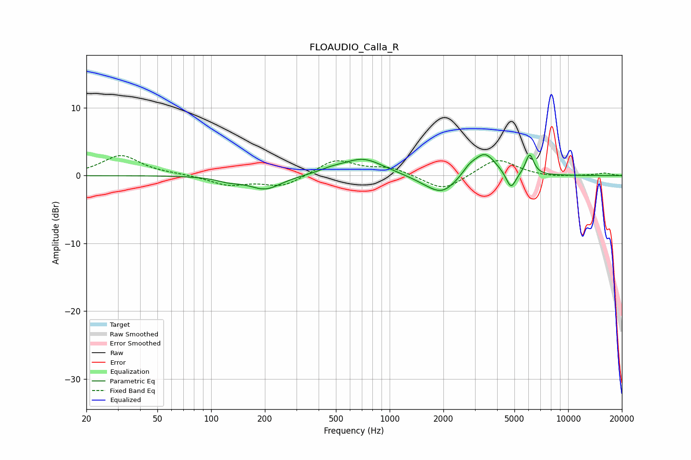

# FLOAUDIO_Calla_R
See [usage instructions](https://github.com/jaakkopasanen/AutoEq#usage) for more options and info.

### Parametric EQs
Apply preamp of -3.2 dB when using parametric equalizer.

|   # | Type    |   Fc (Hz) |    Q |   Gain (dB) |
|-----|---------|-----------|------|-------------|
|   1 | Peaking |       126 | 2.11 |        -0.6 |
|   2 | Peaking |       201 | 1.58 |        -2   |
|   3 | Peaking |       470 | 2.07 |         0.5 |
|   4 | Peaking |       710 | 1.22 |         2.5 |
|   5 | Peaking |      1616 | 1.53 |        -0.6 |
|   6 | Peaking |      1979 | 1.75 |        -2.5 |
|   7 | Peaking |      2792 | 3.67 |         0.9 |
|   8 | Peaking |      3412 | 2.25 |         3.4 |
|   9 | Peaking |      4784 | 5.13 |        -2.6 |
|  10 | Peaking |      6088 | 5.97 |         3.1 |

### Fixed Band EQs
When using fixed band (also called graphic) equalizer, apply preamp of **-3.0 dB** (if available) and set gains manually with these parameters.

|   # | Type    |   Fc (Hz) |    Q |   Gain (dB) |
|-----|---------|-----------|------|-------------|
|   1 | Peaking |        31 | 1.41 |         3   |
|   2 | Peaking |        62 | 1.41 |         0.2 |
|   3 | Peaking |       125 | 1.41 |        -1.4 |
|   4 | Peaking |       250 | 1.41 |        -1.6 |
|   5 | Peaking |       500 | 1.41 |         2.4 |
|   6 | Peaking |      1000 | 1.41 |         1.1 |
|   7 | Peaking |      2000 | 1.41 |        -2.3 |
|   8 | Peaking |      4000 | 1.41 |         2.6 |
|   9 | Peaking |      8000 | 1.41 |        -0.3 |
|  10 | Peaking |     16000 | 1.41 |         0.4 |

### Graphs

