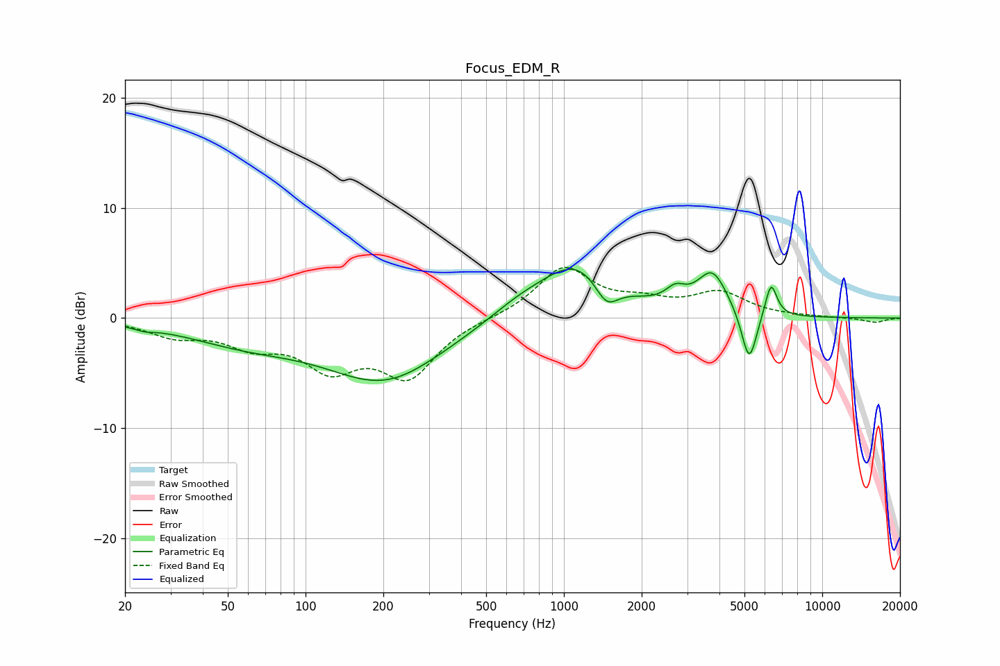

# Focus_EDM_R
See [usage instructions](https://github.com/jaakkopasanen/AutoEq#usage) for more options and info.

### Parametric EQs
Apply preamp of -4.5 dB when using parametric equalizer.

|   # | Type    |   Fc (Hz) |    Q |   Gain (dB) |
|-----|---------|-----------|------|-------------|
|   1 | Peaking |        24 | 3.86 |        -0.3 |
|   2 | Peaking |        58 | 0.6  |        -1.9 |
|   3 | Peaking |       203 | 0.62 |        -5.5 |
|   4 | Peaking |       666 | 1.18 |         1.1 |
|   5 | Peaking |      1123 | 0.98 |         5   |
|   6 | Peaking |      1462 | 3.06 |        -2.4 |
|   7 | Peaking |      2705 | 3.64 |         1.3 |
|   8 | Peaking |      3756 | 2.38 |         3.8 |
|   9 | Peaking |      5214 | 4.67 |        -4.9 |
|  10 | Peaking |      6334 | 6    |         3.2 |

### Fixed Band EQs
When using fixed band (also called graphic) equalizer, apply preamp of **-4.7 dB** (if available) and set gains manually with these parameters.

|   # | Type    |   Fc (Hz) |    Q |   Gain (dB) |
|-----|---------|-----------|------|-------------|
|   1 | Peaking |        31 | 1.41 |        -1.4 |
|   2 | Peaking |        62 | 1.41 |        -2.1 |
|   3 | Peaking |       125 | 1.41 |        -4   |
|   4 | Peaking |       250 | 1.41 |        -5   |
|   5 | Peaking |       500 | 1.41 |         0   |
|   6 | Peaking |      1000 | 1.41 |         4.5 |
|   7 | Peaking |      2000 | 1.41 |         1.1 |
|   8 | Peaking |      4000 | 1.41 |         2.2 |
|   9 | Peaking |      8000 | 1.41 |         0.1 |
|  10 | Peaking |     16000 | 1.41 |        -0.4 |

### Graphs

