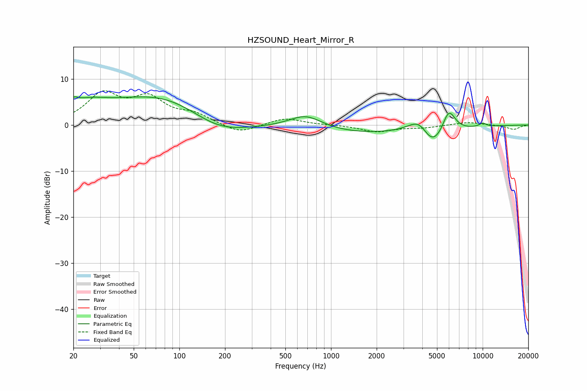

# HZSOUND_Heart_Mirror_R
See [usage instructions](https://github.com/jaakkopasanen/AutoEq#usage) for more options and info.

### Parametric EQs
Apply preamp of -6.2 dB when using parametric equalizer.

|   # | Type    |   Fc (Hz) |    Q |   Gain (dB) |
|-----|---------|-----------|------|-------------|
|   1 | Peaking |        20 | 5.87 |         1.1 |
|   2 | Peaking |        24 | 0.94 |         3.2 |
|   3 | Peaking |        91 | 0.39 |         8.1 |
|   4 | Peaking |       175 | 0.61 |        -6   |
|   5 | Peaking |       682 | 1.29 |         3   |
|   6 | Peaking |      1439 | 0.46 |        -1.7 |
|   7 | Peaking |      3903 | 1.67 |         6.6 |
|   8 | Peaking |      4542 | 1.38 |        -8.3 |
|   9 | Peaking |      5974 | 3.03 |         5.7 |
|  10 | Peaking |     10000 | 5.22 |         0.8 |

### Fixed Band EQs
When using fixed band (also called graphic) equalizer, apply preamp of **-7.5 dB** (if available) and set gains manually with these parameters.

|   # | Type    |   Fc (Hz) |    Q |   Gain (dB) |
|-----|---------|-----------|------|-------------|
|   1 | Peaking |        31 | 1.41 |         6.4 |
|   2 | Peaking |        62 | 1.41 |         5.2 |
|   3 | Peaking |       125 | 1.41 |         2   |
|   4 | Peaking |       250 | 1.41 |        -1.9 |
|   5 | Peaking |       500 | 1.41 |         1.5 |
|   6 | Peaking |      1000 | 1.41 |         0   |
|   7 | Peaking |      2000 | 1.41 |        -1.4 |
|   8 | Peaking |      4000 | 1.41 |        -0.5 |
|   9 | Peaking |      8000 | 1.41 |         0.7 |
|  10 | Peaking |     16000 | 1.41 |        -1   |

### Graphs

