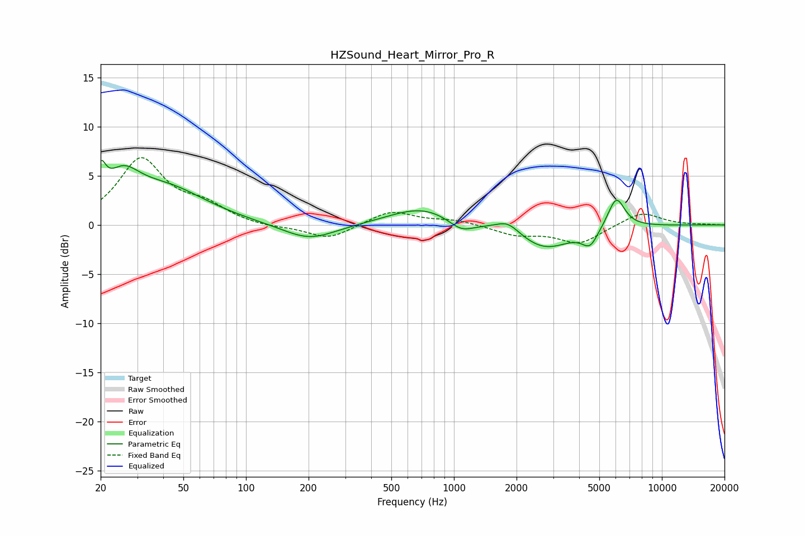

# HZSound_Heart_Mirror_Pro_R
See [usage instructions](https://github.com/jaakkopasanen/AutoEq#usage) for more options and info.

### Parametric EQs
Apply preamp of -6.7 dB when using parametric equalizer.

|   # | Type    |   Fc (Hz) |    Q |   Gain (dB) |
|-----|---------|-----------|------|-------------|
|   1 | Peaking |        20 | 5.93 |         3   |
|   2 | Peaking |        25 | 1.73 |         3.4 |
|   3 | Peaking |        41 | 0.72 |         3.5 |
|   4 | Peaking |       201 | 1.1  |        -1.7 |
|   5 | Peaking |       704 | 0.89 |         1.8 |
|   6 | Peaking |      1085 | 2.28 |        -1.2 |
|   7 | Peaking |      1817 | 2.53 |         1.1 |
|   8 | Peaking |      2737 | 1.1  |        -2.5 |
|   9 | Peaking |      4512 | 3.65 |        -1.7 |
|  10 | Peaking |      6034 | 3.35 |         3.2 |

### Fixed Band EQs
When using fixed band (also called graphic) equalizer, apply preamp of **-6.9 dB** (if available) and set gains manually with these parameters.

|   # | Type    |   Fc (Hz) |    Q |   Gain (dB) |
|-----|---------|-----------|------|-------------|
|   1 | Peaking |        31 | 1.41 |         6.5 |
|   2 | Peaking |        62 | 1.41 |         1.7 |
|   3 | Peaking |       125 | 1.41 |        -0.3 |
|   4 | Peaking |       250 | 1.41 |        -1.5 |
|   5 | Peaking |       500 | 1.41 |         1.5 |
|   6 | Peaking |      1000 | 1.41 |         0.5 |
|   7 | Peaking |      2000 | 1.41 |        -0.9 |
|   8 | Peaking |      4000 | 1.41 |        -1.9 |
|   9 | Peaking |      8000 | 1.41 |         1.4 |
|  10 | Peaking |     16000 | 1.41 |         0   |

### Graphs

