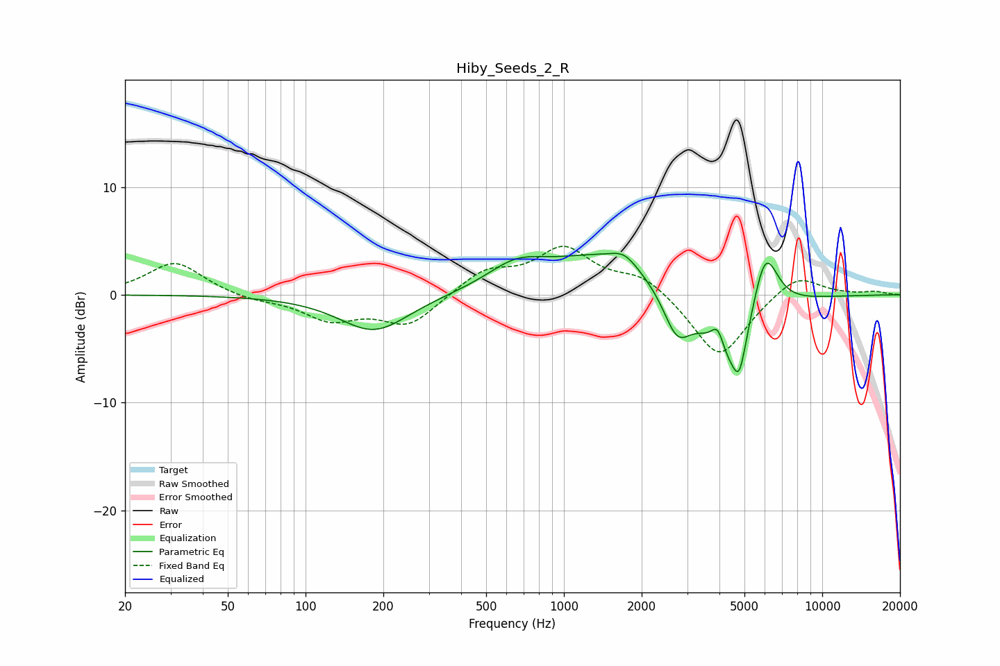

# Hiby_Seeds_2_R
See [usage instructions](https://github.com/jaakkopasanen/AutoEq#usage) for more options and info.

### Parametric EQs
Apply preamp of -3.9 dB when using parametric equalizer.

|   # | Type    |   Fc (Hz) |    Q |   Gain (dB) |
|-----|---------|-----------|------|-------------|
|   1 | Peaking |       184 | 1.05 |        -3.5 |
|   2 | Peaking |       651 | 1.28 |         2   |
|   3 | Peaking |      1448 | 0.61 |         3.7 |
|   4 | Peaking |      1713 | 2.79 |         1.1 |
|   5 | Peaking |      2739 | 2.61 |        -4.1 |
|   6 | Peaking |      3941 | 5.38 |         2.5 |
|   7 | Peaking |      4469 | 1.48 |        -7.9 |
|   8 | Peaking |      4780 | 6    |        -2.7 |
|   9 | Peaking |      5863 | 2.32 |         1.7 |
|  10 | Peaking |      6022 | 2.83 |         5   |

### Fixed Band EQs
When using fixed band (also called graphic) equalizer, apply preamp of **-4.6 dB** (if available) and set gains manually with these parameters.

|   # | Type    |   Fc (Hz) |    Q |   Gain (dB) |
|-----|---------|-----------|------|-------------|
|   1 | Peaking |        31 | 1.41 |         3.1 |
|   2 | Peaking |        62 | 1.41 |        -0.5 |
|   3 | Peaking |       125 | 1.41 |        -2.2 |
|   4 | Peaking |       250 | 1.41 |        -2.8 |
|   5 | Peaking |       500 | 1.41 |         2.1 |
|   6 | Peaking |      1000 | 1.41 |         4.1 |
|   7 | Peaking |      2000 | 1.41 |         1.8 |
|   8 | Peaking |      4000 | 1.41 |        -6   |
|   9 | Peaking |      8000 | 1.41 |         2.1 |
|  10 | Peaking |     16000 | 1.41 |         0.3 |

### Graphs

