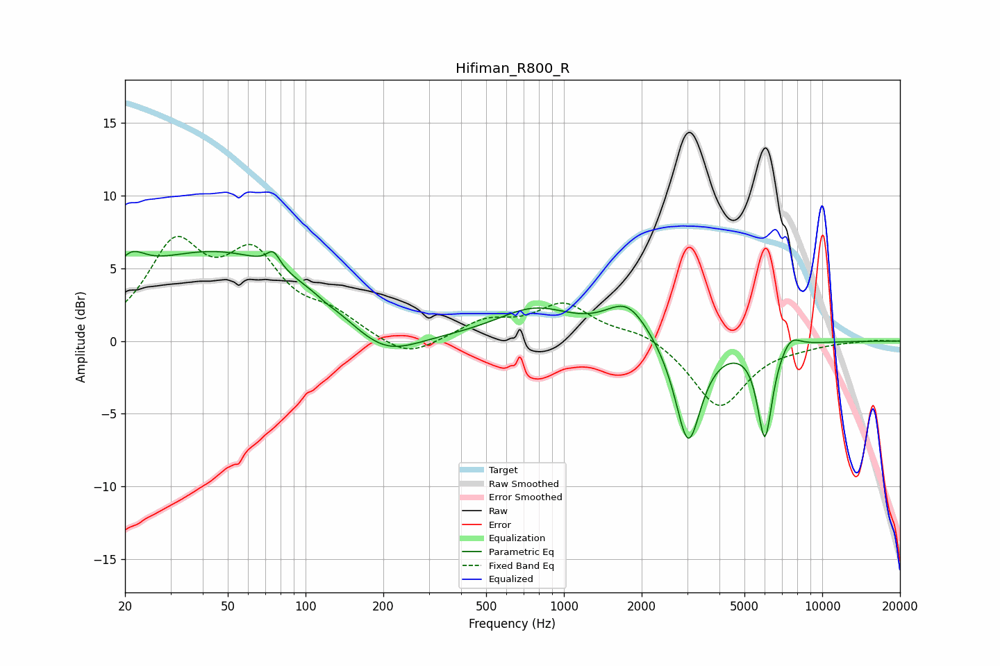

# Hifiman_R800_R
See [usage instructions](https://github.com/jaakkopasanen/AutoEq#usage) for more options and info.

### Parametric EQs
Apply preamp of -6.3 dB when using parametric equalizer.

|   # | Type    |   Fc (Hz) |    Q |   Gain (dB) |
|-----|---------|-----------|------|-------------|
|   1 | Peaking |        21 | 2.54 |         1.8 |
|   2 | Peaking |        46 | 0.36 |         6.1 |
|   3 | Peaking |        75 | 5.47 |         1.1 |
|   4 | Peaking |       121 | 5.5  |        -0.1 |
|   5 | Peaking |       200 | 1.03 |        -2.3 |
|   6 | Peaking |       772 | 0.95 |         2.1 |
|   7 | Peaking |      1762 | 1.66 |         2.5 |
|   8 | Peaking |      3028 | 2.82 |        -7.3 |
|   9 | Peaking |      5996 | 4.81 |        -6.5 |
|  10 | Peaking |      7539 | 3.56 |         0.9 |

### Fixed Band EQs
When using fixed band (also called graphic) equalizer, apply preamp of **-7.3 dB** (if available) and set gains manually with these parameters.

|   # | Type    |   Fc (Hz) |    Q |   Gain (dB) |
|-----|---------|-----------|------|-------------|
|   1 | Peaking |        31 | 1.41 |         6.1 |
|   2 | Peaking |        62 | 1.41 |         5.2 |
|   3 | Peaking |       125 | 1.41 |         1.4 |
|   4 | Peaking |       250 | 1.41 |        -1.3 |
|   5 | Peaking |       500 | 1.41 |         1.3 |
|   6 | Peaking |      1000 | 1.41 |         2.4 |
|   7 | Peaking |      2000 | 1.41 |         0.7 |
|   8 | Peaking |      4000 | 1.41 |        -4.6 |
|   9 | Peaking |      8000 | 1.41 |        -0.2 |
|  10 | Peaking |     16000 | 1.41 |         0.1 |

### Graphs

