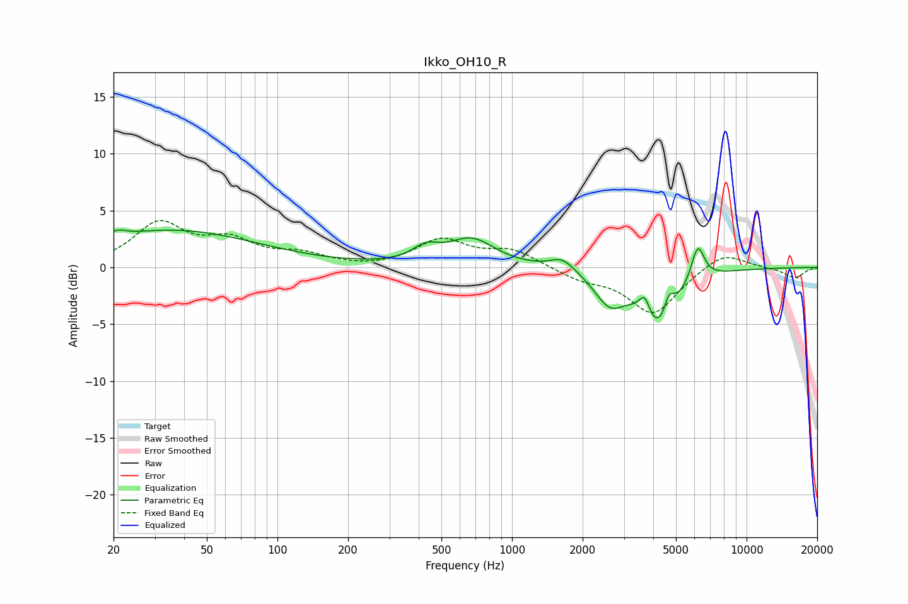

# Ikko_OH10_R
See [usage instructions](https://github.com/jaakkopasanen/AutoEq#usage) for more options and info.

### Parametric EQs
Apply preamp of -3.4 dB when using parametric equalizer.

|   # | Type    |   Fc (Hz) |    Q |   Gain (dB) |
|-----|---------|-----------|------|-------------|
|   1 | Peaking |        21 | 4.08 |         0.5 |
|   2 | Peaking |        35 | 0.38 |         3.2 |
|   3 | Peaking |       429 | 2.46 |         1.2 |
|   4 | Peaking |       672 | 1.41 |         2.4 |
|   5 | Peaking |      1641 | 2.66 |         1.1 |
|   6 | Peaking |      2608 | 2.17 |        -2.7 |
|   7 | Peaking |      3676 | 6    |         1.8 |
|   8 | Peaking |      4244 | 1.78 |        -5.4 |
|   9 | Peaking |      4671 | 6    |         2.1 |
|  10 | Peaking |      6193 | 4.89 |         3.2 |

### Fixed Band EQs
When using fixed band (also called graphic) equalizer, apply preamp of **-4.2 dB** (if available) and set gains manually with these parameters.

|   # | Type    |   Fc (Hz) |    Q |   Gain (dB) |
|-----|---------|-----------|------|-------------|
|   1 | Peaking |        31 | 1.41 |         3.7 |
|   2 | Peaking |        62 | 1.41 |         2   |
|   3 | Peaking |       125 | 1.41 |         1   |
|   4 | Peaking |       250 | 1.41 |        -0.2 |
|   5 | Peaking |       500 | 1.41 |         2.3 |
|   6 | Peaking |      1000 | 1.41 |         1.4 |
|   7 | Peaking |      2000 | 1.41 |        -0.9 |
|   8 | Peaking |      4000 | 1.41 |        -4.1 |
|   9 | Peaking |      8000 | 1.41 |         1.5 |
|  10 | Peaking |     16000 | 1.41 |        -0.9 |

### Graphs

