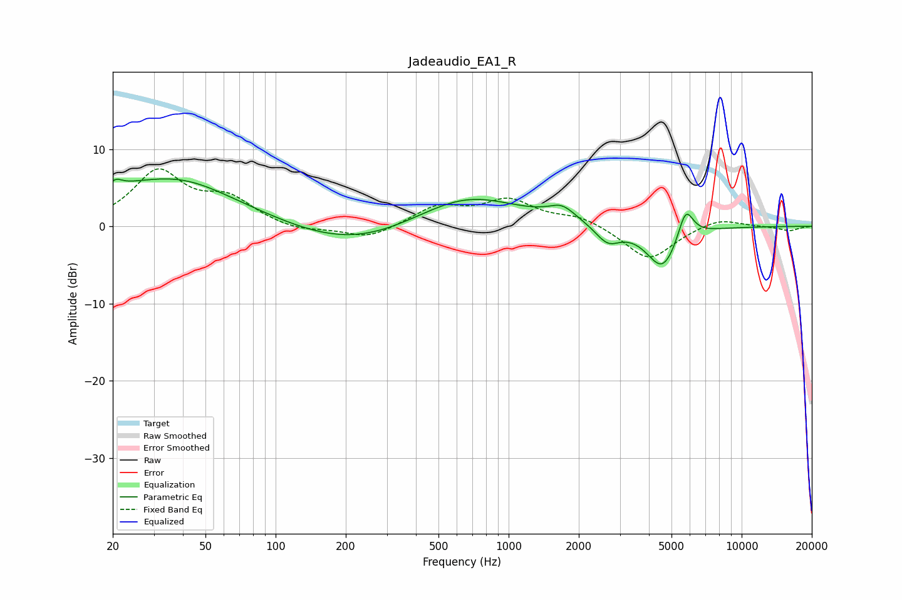

# Jadeaudio_EA1_R
See [usage instructions](https://github.com/jaakkopasanen/AutoEq#usage) for more options and info.

### Parametric EQs
Apply preamp of -6.2 dB when using parametric equalizer.

|   # | Type    |   Fc (Hz) |    Q |   Gain (dB) |
|-----|---------|-----------|------|-------------|
|   1 | Peaking |        21 | 5.84 |         0.8 |
|   2 | Peaking |        28 | 0.34 |         5   |
|   3 | Peaking |        40 | 0.83 |         1.6 |
|   4 | Peaking |       214 | 0.51 |        -3   |
|   5 | Peaking |       656 | 0.63 |         4.3 |
|   6 | Peaking |      1520 | 5.41 |        -0.1 |
|   7 | Peaking |      1682 | 2.31 |         1.9 |
|   8 | Peaking |      2662 | 2.69 |        -2.3 |
|   9 | Peaking |      4582 | 2.04 |        -5.6 |
|  10 | Peaking |      5749 | 4.17 |         4.2 |

### Fixed Band EQs
When using fixed band (also called graphic) equalizer, apply preamp of **-7.5 dB** (if available) and set gains manually with these parameters.

|   # | Type    |   Fc (Hz) |    Q |   Gain (dB) |
|-----|---------|-----------|------|-------------|
|   1 | Peaking |        31 | 1.41 |         6.9 |
|   2 | Peaking |        62 | 1.41 |         3.2 |
|   3 | Peaking |       125 | 1.41 |        -0.7 |
|   4 | Peaking |       250 | 1.41 |        -1.7 |
|   5 | Peaking |       500 | 1.41 |         2.5 |
|   6 | Peaking |      1000 | 1.41 |         3.2 |
|   7 | Peaking |      2000 | 1.41 |         1.2 |
|   8 | Peaking |      4000 | 1.41 |        -4.5 |
|   9 | Peaking |      8000 | 1.41 |         1.2 |
|  10 | Peaking |     16000 | 1.41 |        -0.6 |

### Graphs

