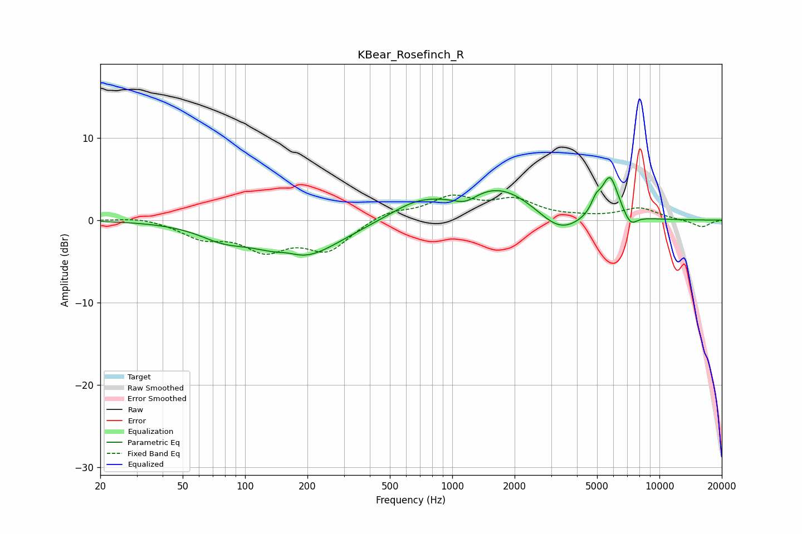

# KBear_Rosefinch_R
See [usage instructions](https://github.com/jaakkopasanen/AutoEq#usage) for more options and info.

### Parametric EQs
Apply preamp of -5.3 dB when using parametric equalizer.

|   # | Type    |   Fc (Hz) |    Q |   Gain (dB) |
|-----|---------|-----------|------|-------------|
|   1 | Peaking |        78 | 1.24 |        -1.4 |
|   2 | Peaking |       161 | 2.53 |         0.6 |
|   3 | Peaking |       184 | 0.75 |        -4.7 |
|   4 | Peaking |       675 | 1.05 |         1.9 |
|   5 | Peaking |      1158 | 2.38 |        -1.2 |
|   6 | Peaking |      1667 | 0.74 |         4.2 |
|   7 | Peaking |      3292 | 1.33 |        -2.8 |
|   8 | Peaking |      4935 | 5.9  |         1.4 |
|   9 | Peaking |      5766 | 3.35 |         5.3 |
|  10 | Peaking |      7247 | 4.24 |        -1.5 |

### Fixed Band EQs
When using fixed band (also called graphic) equalizer, apply preamp of **-3.2 dB** (if available) and set gains manually with these parameters.

|   # | Type    |   Fc (Hz) |    Q |   Gain (dB) |
|-----|---------|-----------|------|-------------|
|   1 | Peaking |        31 | 1.41 |         0.5 |
|   2 | Peaking |        62 | 1.41 |        -1.9 |
|   3 | Peaking |       125 | 1.41 |        -3.2 |
|   4 | Peaking |       250 | 1.41 |        -3.5 |
|   5 | Peaking |       500 | 1.41 |         1.1 |
|   6 | Peaking |      1000 | 1.41 |         2.6 |
|   7 | Peaking |      2000 | 1.41 |         2.2 |
|   8 | Peaking |      4000 | 1.41 |         0.2 |
|   9 | Peaking |      8000 | 1.41 |         1.4 |
|  10 | Peaking |     16000 | 1.41 |        -0.9 |

### Graphs

