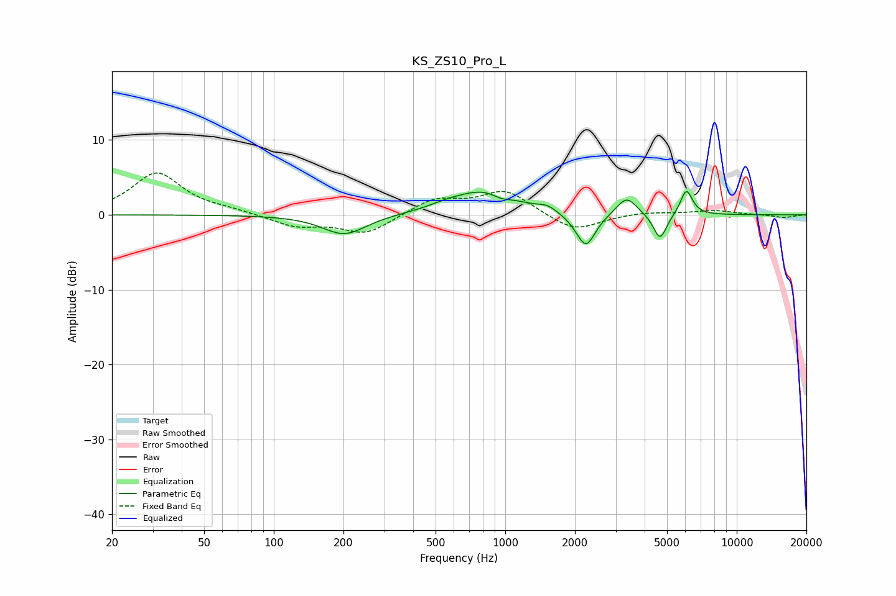

# KS_ZS10_Pro_L
See [usage instructions](https://github.com/jaakkopasanen/AutoEq#usage) for more options and info.

### Parametric EQs
Apply preamp of -3.2 dB when using parametric equalizer.

|   # | Type    |   Fc (Hz) |    Q |   Gain (dB) |
|-----|---------|-----------|------|-------------|
|   1 | Peaking |       202 | 1.5  |        -2.7 |
|   2 | Peaking |       550 | 1.99 |         0.4 |
|   3 | Peaking |       813 | 1.04 |         3.2 |
|   4 | Peaking |       958 | 3.62 |        -0.6 |
|   5 | Peaking |      1517 | 3.54 |         0.7 |
|   6 | Peaking |      2091 | 2.91 |        -0.5 |
|   7 | Peaking |      2238 | 3.48 |        -4.2 |
|   8 | Peaking |      3347 | 3.27 |         2.5 |
|   9 | Peaking |      4665 | 4.81 |        -3.6 |
|  10 | Peaking |      6061 | 5.32 |         3.4 |

### Fixed Band EQs
When using fixed band (also called graphic) equalizer, apply preamp of **-5.7 dB** (if available) and set gains manually with these parameters.

|   # | Type    |   Fc (Hz) |    Q |   Gain (dB) |
|-----|---------|-----------|------|-------------|
|   1 | Peaking |        31 | 1.41 |         5.6 |
|   2 | Peaking |        62 | 1.41 |         0.5 |
|   3 | Peaking |       125 | 1.41 |        -1.5 |
|   4 | Peaking |       250 | 1.41 |        -2.5 |
|   5 | Peaking |       500 | 1.41 |         2.1 |
|   6 | Peaking |      1000 | 1.41 |         3.2 |
|   7 | Peaking |      2000 | 1.41 |        -2.3 |
|   8 | Peaking |      4000 | 1.41 |         0.4 |
|   9 | Peaking |      8000 | 1.41 |         0.6 |
|  10 | Peaking |     16000 | 1.41 |        -0.4 |

### Graphs

