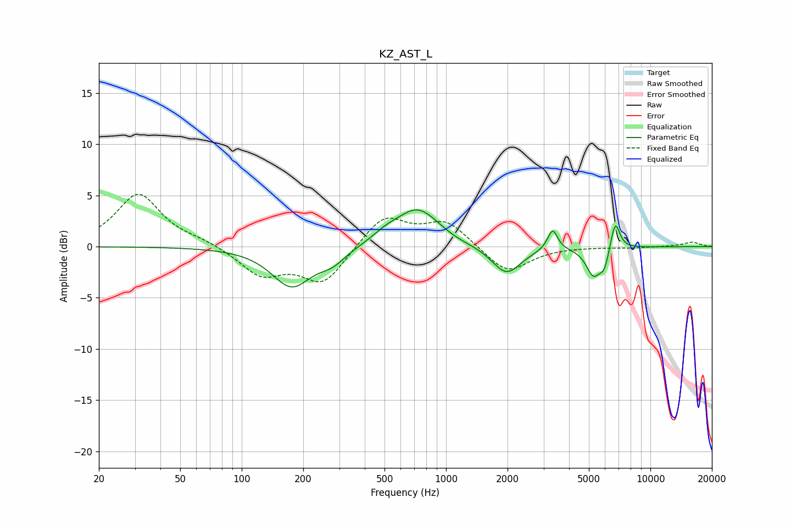

# KZ_AST_L
See [usage instructions](https://github.com/jaakkopasanen/AutoEq#usage) for more options and info.

### Parametric EQs
Apply preamp of -3.7 dB when using parametric equalizer.

|   # | Type    |   Fc (Hz) |    Q |   Gain (dB) |
|-----|---------|-----------|------|-------------|
|   1 | Peaking |       176 | 1.45 |        -3.9 |
|   2 | Peaking |       278 | 2.14 |        -1.2 |
|   3 | Peaking |       506 | 2.23 |         0.6 |
|   4 | Peaking |       727 | 1.29 |         3.8 |
|   5 | Peaking |      1102 | 1.77 |        -0.2 |
|   6 | Peaking |      1975 | 1.98 |        -2.8 |
|   7 | Peaking |      3323 | 5.82 |         2.1 |
|   8 | Peaking |      5265 | 3.89 |        -2.7 |
|   9 | Peaking |      5954 | 6    |        -1.7 |
|  10 | Peaking |      6728 | 5.96 |         2.9 |

### Fixed Band EQs
When using fixed band (also called graphic) equalizer, apply preamp of **-5.2 dB** (if available) and set gains manually with these parameters.

|   # | Type    |   Fc (Hz) |    Q |   Gain (dB) |
|-----|---------|-----------|------|-------------|
|   1 | Peaking |        31 | 1.41 |         5.1 |
|   2 | Peaking |        62 | 1.41 |         0.5 |
|   3 | Peaking |       125 | 1.41 |        -2.7 |
|   4 | Peaking |       250 | 1.41 |        -3.6 |
|   5 | Peaking |       500 | 1.41 |         3.1 |
|   6 | Peaking |      1000 | 1.41 |         2.4 |
|   7 | Peaking |      2000 | 1.41 |        -2.7 |
|   8 | Peaking |      4000 | 1.41 |        -0   |
|   9 | Peaking |      8000 | 1.41 |        -0.1 |
|  10 | Peaking |     16000 | 1.41 |         0.4 |

### Graphs

