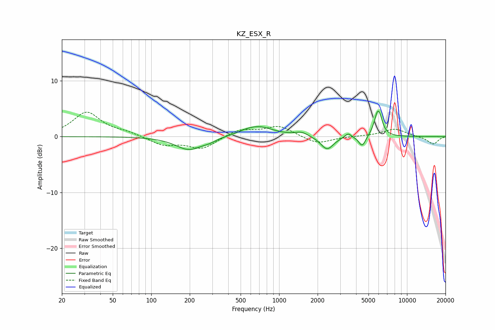

# KZ_ESX_R
See [usage instructions](https://github.com/jaakkopasanen/AutoEq#usage) for more options and info.

### Parametric EQs
Apply preamp of -4.7 dB when using parametric equalizer.

|   # | Type    |   Fc (Hz) |    Q |   Gain (dB) |
|-----|---------|-----------|------|-------------|
|   1 | Peaking |       197 | 1.39 |        -2.3 |
|   2 | Peaking |       284 | 2.74 |        -0.5 |
|   3 | Peaking |       545 | 2.54 |         0.2 |
|   4 | Peaking |       686 | 1.22 |         1.8 |
|   5 | Peaking |      1497 | 2.86 |         0.7 |
|   6 | Peaking |      2372 | 2.86 |        -2.4 |
|   7 | Peaking |      3461 | 5.51 |         0.8 |
|   8 | Peaking |      4467 | 5.09 |        -1.9 |
|   9 | Peaking |      5902 | 4.87 |         4   |
|  10 | Peaking |      6149 | 5.99 |         1   |

### Fixed Band EQs
When using fixed band (also called graphic) equalizer, apply preamp of **-4.5 dB** (if available) and set gains manually with these parameters.

|   # | Type    |   Fc (Hz) |    Q |   Gain (dB) |
|-----|---------|-----------|------|-------------|
|   1 | Peaking |        31 | 1.41 |         4.3 |
|   2 | Peaking |        62 | 1.41 |         0.6 |
|   3 | Peaking |       125 | 1.41 |        -1.5 |
|   4 | Peaking |       250 | 1.41 |        -2.1 |
|   5 | Peaking |       500 | 1.41 |         1.3 |
|   6 | Peaking |      1000 | 1.41 |         1.9 |
|   7 | Peaking |      2000 | 1.41 |        -1.4 |
|   8 | Peaking |      4000 | 1.41 |         0.1 |
|   9 | Peaking |      8000 | 1.41 |         1.4 |
|  10 | Peaking |     16000 | 1.41 |        -1.4 |

### Graphs

