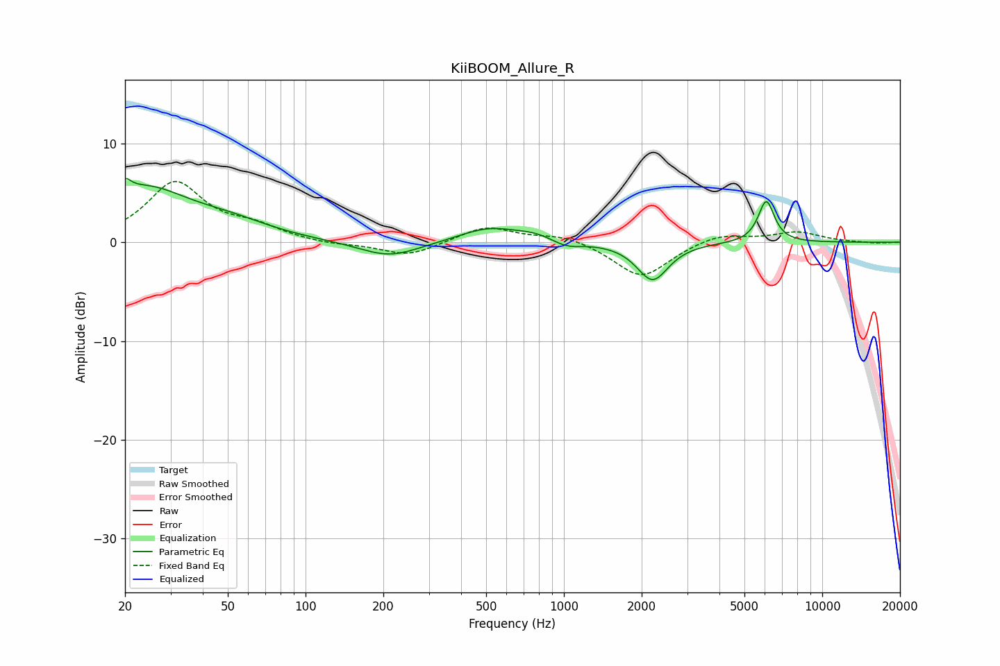

# KiiBOOM_Allure_R
See [usage instructions](https://github.com/jaakkopasanen/AutoEq#usage) for more options and info.

### Parametric EQs
Apply preamp of -6.5 dB when using parametric equalizer.

|   # | Type    |   Fc (Hz) |    Q |   Gain (dB) |
|-----|---------|-----------|------|-------------|
|   1 | Peaking |        20 | 5.99 |         5.3 |
|   2 | Peaking |        20 | 6    |        -3.8 |
|   3 | Peaking |        24 | 0.83 |         5.1 |
|   4 | Peaking |        51 | 0.88 |         1.4 |
|   5 | Peaking |       211 | 1.2  |        -1.6 |
|   6 | Peaking |       515 | 1.2  |         1.5 |
|   7 | Peaking |       772 | 2.06 |         0.5 |
|   8 | Peaking |      1027 | 2.55 |        -0.7 |
|   9 | Peaking |      2205 | 2.34 |        -3.8 |
|  10 | Peaking |      6072 | 4.45 |         4.2 |

### Fixed Band EQs
When using fixed band (also called graphic) equalizer, apply preamp of **-6.3 dB** (if available) and set gains manually with these parameters.

|   # | Type    |   Fc (Hz) |    Q |   Gain (dB) |
|-----|---------|-----------|------|-------------|
|   1 | Peaking |        31 | 1.41 |         5.9 |
|   2 | Peaking |        62 | 1.41 |         1.3 |
|   3 | Peaking |       125 | 1.41 |        -0.3 |
|   4 | Peaking |       250 | 1.41 |        -1.4 |
|   5 | Peaking |       500 | 1.41 |         1.6 |
|   6 | Peaking |      1000 | 1.41 |         0.8 |
|   7 | Peaking |      2000 | 1.41 |        -3.6 |
|   8 | Peaking |      4000 | 1.41 |         0.9 |
|   9 | Peaking |      8000 | 1.41 |         1   |
|  10 | Peaking |     16000 | 1.41 |        -0.1 |

### Graphs

