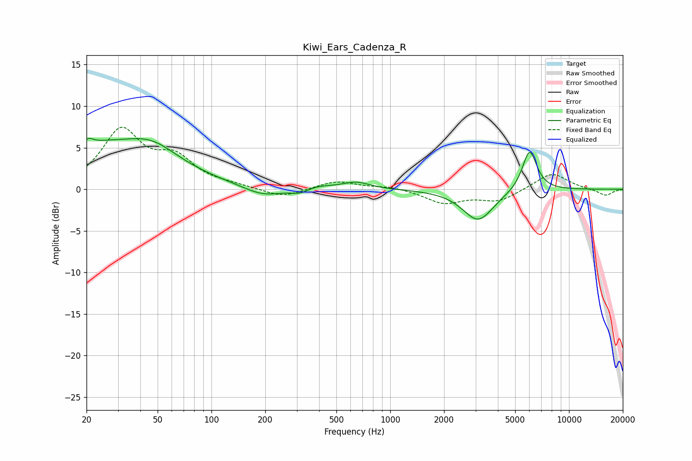

# Kiwi_Ears_Cadenza_R
See [usage instructions](https://github.com/jaakkopasanen/AutoEq#usage) for more options and info.

### Parametric EQs
Apply preamp of -6.2 dB when using parametric equalizer.

|   # | Type    |   Fc (Hz) |    Q |   Gain (dB) |
|-----|---------|-----------|------|-------------|
|   1 | Peaking |        20 | 6    |        -2.7 |
|   2 | Peaking |        20 | 5.88 |         3.3 |
|   3 | Peaking |        24 | 0.38 |         5.2 |
|   4 | Peaking |        47 | 1.09 |         1.8 |
|   5 | Peaking |       195 | 1.27 |        -1.2 |
|   6 | Peaking |       314 | 2.61 |        -0.7 |
|   7 | Peaking |       370 | 1.44 |         0.5 |
|   8 | Peaking |       647 | 1.87 |         0.8 |
|   9 | Peaking |      3105 | 1.64 |        -3.8 |
|  10 | Peaking |      6017 | 3.35 |         5   |

### Fixed Band EQs
When using fixed band (also called graphic) equalizer, apply preamp of **-7.6 dB** (if available) and set gains manually with these parameters.

|   # | Type    |   Fc (Hz) |    Q |   Gain (dB) |
|-----|---------|-----------|------|-------------|
|   1 | Peaking |        31 | 1.41 |         6.8 |
|   2 | Peaking |        62 | 1.41 |         3.3 |
|   3 | Peaking |       125 | 1.41 |         0.3 |
|   4 | Peaking |       250 | 1.41 |        -1.1 |
|   5 | Peaking |       500 | 1.41 |         1   |
|   6 | Peaking |      1000 | 1.41 |         0.3 |
|   7 | Peaking |      2000 | 1.41 |        -1.6 |
|   8 | Peaking |      4000 | 1.41 |        -1.4 |
|   9 | Peaking |      8000 | 1.41 |         2   |
|  10 | Peaking |     16000 | 1.41 |        -0.8 |

### Graphs

