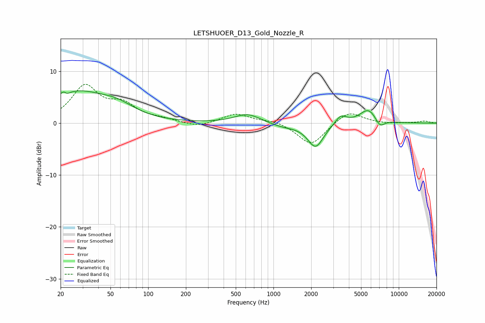

# LETSHUOER_D13_Gold_Nozzle_R
See [usage instructions](https://github.com/jaakkopasanen/AutoEq#usage) for more options and info.

### Parametric EQs
Apply preamp of -6.3 dB when using parametric equalizer.

|   # | Type    |   Fc (Hz) |    Q |   Gain (dB) |
|-----|---------|-----------|------|-------------|
|   1 | Peaking |        22 | 5.93 |         3.1 |
|   2 | Peaking |        22 | 5.91 |        -2.9 |
|   3 | Peaking |        27 | 0.59 |         5.7 |
|   4 | Peaking |        57 | 1.02 |         1.9 |
|   5 | Peaking |       620 | 1.39 |         1.8 |
|   6 | Peaking |      1199 | 1.31 |        -0.7 |
|   7 | Peaking |      2167 | 2.21 |        -4.6 |
|   8 | Peaking |      3442 | 3.06 |         1.7 |
|   9 | Peaking |      5724 | 2.01 |         2.8 |
|  10 | Peaking |      7060 | 3.61 |        -1.7 |

### Fixed Band EQs
When using fixed band (also called graphic) equalizer, apply preamp of **-7.6 dB** (if available) and set gains manually with these parameters.

|   # | Type    |   Fc (Hz) |    Q |   Gain (dB) |
|-----|---------|-----------|------|-------------|
|   1 | Peaking |        31 | 1.41 |         6.9 |
|   2 | Peaking |        62 | 1.41 |         3.1 |
|   3 | Peaking |       125 | 1.41 |         0.6 |
|   4 | Peaking |       250 | 1.41 |        -0.8 |
|   5 | Peaking |       500 | 1.41 |         1.8 |
|   6 | Peaking |      1000 | 1.41 |         0.6 |
|   7 | Peaking |      2000 | 1.41 |        -4.3 |
|   8 | Peaking |      4000 | 1.41 |         2.5 |
|   9 | Peaking |      8000 | 1.41 |        -0.1 |
|  10 | Peaking |     16000 | 1.41 |         0.4 |

### Graphs

