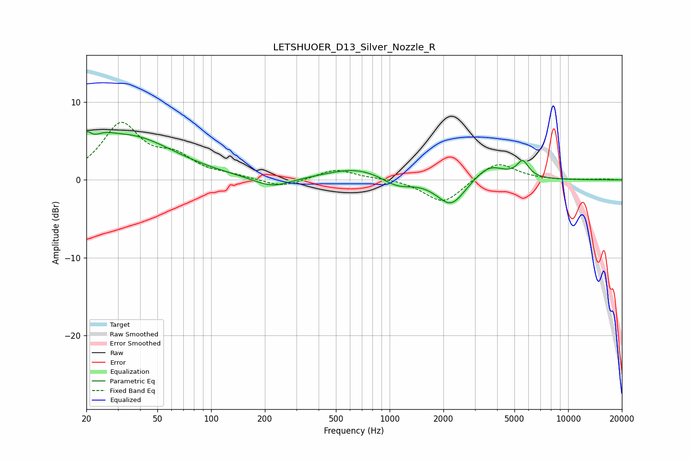

# LETSHUOER_D13_Silver_Nozzle_R
See [usage instructions](https://github.com/jaakkopasanen/AutoEq#usage) for more options and info.

### Parametric EQs
Apply preamp of -6.3 dB when using parametric equalizer.

|   # | Type    |   Fc (Hz) |    Q |   Gain (dB) |
|-----|---------|-----------|------|-------------|
|   1 | Peaking |        20 | 5.73 |         1.8 |
|   2 | Peaking |        25 | 2.21 |         1.2 |
|   3 | Peaking |        35 | 0.57 |         5.4 |
|   4 | Peaking |       219 | 1.37 |        -1.3 |
|   5 | Peaking |       660 | 0.83 |         1.6 |
|   6 | Peaking |      1095 | 1.67 |        -1.3 |
|   7 | Peaking |      2209 | 1.8  |        -3.5 |
|   8 | Peaking |      3616 | 1.62 |         2.1 |
|   9 | Peaking |      5551 | 4.29 |        -0.8 |
|  10 | Peaking |      5561 | 4.21 |         2.8 |

### Fixed Band EQs
When using fixed band (also called graphic) equalizer, apply preamp of **-7.5 dB** (if available) and set gains manually with these parameters.

|   # | Type    |   Fc (Hz) |    Q |   Gain (dB) |
|-----|---------|-----------|------|-------------|
|   1 | Peaking |        31 | 1.41 |         6.9 |
|   2 | Peaking |        62 | 1.41 |         2.5 |
|   3 | Peaking |       125 | 1.41 |         0.4 |
|   4 | Peaking |       250 | 1.41 |        -1   |
|   5 | Peaking |       500 | 1.41 |         1.4 |
|   6 | Peaking |      1000 | 1.41 |         0.2 |
|   7 | Peaking |      2000 | 1.41 |        -3.1 |
|   8 | Peaking |      4000 | 1.41 |         2.4 |
|   9 | Peaking |      8000 | 1.41 |        -0   |
|  10 | Peaking |     16000 | 1.41 |         0.1 |

### Graphs

