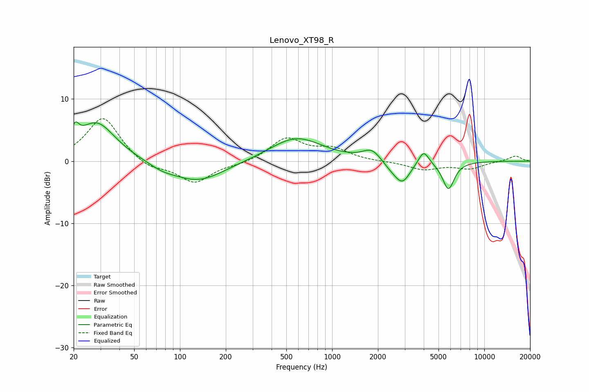

# Lenovo_XT98_R
See [usage instructions](https://github.com/jaakkopasanen/AutoEq#usage) for more options and info.

### Parametric EQs
Apply preamp of -6.4 dB when using parametric equalizer.

|   # | Type    |   Fc (Hz) |    Q |   Gain (dB) |
|-----|---------|-----------|------|-------------|
|   1 | Peaking |        20 | 5.77 |         2.4 |
|   2 | Peaking |        28 | 1.14 |         6.3 |
|   3 | Peaking |        76 | 1.69 |        -0.7 |
|   4 | Peaking |       131 | 0.81 |        -3.3 |
|   5 | Peaking |       580 | 0.83 |         3.9 |
|   6 | Peaking |      1825 | 2.39 |         1.8 |
|   7 | Peaking |      2436 | 2.35 |        -1   |
|   8 | Peaking |      2898 | 2.72 |        -3.3 |
|   9 | Peaking |      3994 | 4.08 |         2.3 |
|  10 | Peaking |      5810 | 3.56 |        -4.5 |

### Fixed Band EQs
When using fixed band (also called graphic) equalizer, apply preamp of **-6.9 dB** (if available) and set gains manually with these parameters.

|   # | Type    |   Fc (Hz) |    Q |   Gain (dB) |
|-----|---------|-----------|------|-------------|
|   1 | Peaking |        31 | 1.41 |         7.2 |
|   2 | Peaking |        62 | 1.41 |        -1.4 |
|   3 | Peaking |       125 | 1.41 |        -3.4 |
|   4 | Peaking |       250 | 1.41 |        -0.5 |
|   5 | Peaking |       500 | 1.41 |         3.6 |
|   6 | Peaking |      1000 | 1.41 |         1.8 |
|   7 | Peaking |      2000 | 1.41 |        -0.1 |
|   8 | Peaking |      4000 | 1.41 |        -1.3 |
|   9 | Peaking |      8000 | 1.41 |        -1.1 |
|  10 | Peaking |     16000 | 1.41 |         0.9 |

### Graphs

