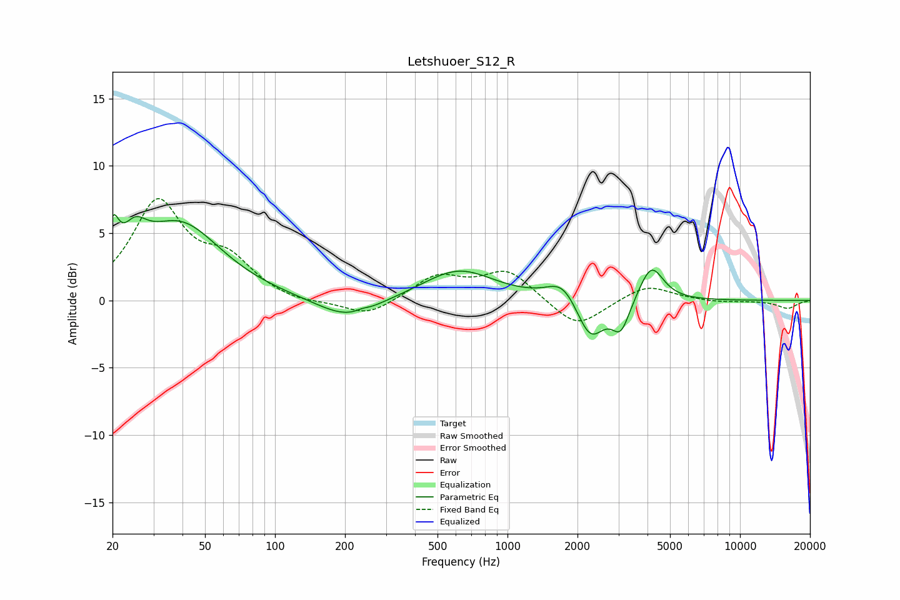

# Letshuoer_S12_R
See [usage instructions](https://github.com/jaakkopasanen/AutoEq#usage) for more options and info.

### Parametric EQs
Apply preamp of -6.5 dB when using parametric equalizer.

|   # | Type    |   Fc (Hz) |    Q |   Gain (dB) |
|-----|---------|-----------|------|-------------|
|   1 | Peaking |        20 | 5.86 |         3   |
|   2 | Peaking |        25 | 2.74 |         2.2 |
|   3 | Peaking |        39 | 0.8  |         5.6 |
|   4 | Peaking |       206 | 1.07 |        -1.6 |
|   5 | Peaking |       236 | 5.94 |         0.1 |
|   6 | Peaking |       616 | 0.93 |         2.3 |
|   7 | Peaking |      1729 | 2.15 |         1.6 |
|   8 | Peaking |      2269 | 2.37 |        -3.1 |
|   9 | Peaking |      3072 | 3.74 |        -2.2 |
|  10 | Peaking |      4153 | 2.73 |         2.7 |

### Fixed Band EQs
When using fixed band (also called graphic) equalizer, apply preamp of **-7.7 dB** (if available) and set gains manually with these parameters.

|   # | Type    |   Fc (Hz) |    Q |   Gain (dB) |
|-----|---------|-----------|------|-------------|
|   1 | Peaking |        31 | 1.41 |         7.1 |
|   2 | Peaking |        62 | 1.41 |         2.6 |
|   3 | Peaking |       125 | 1.41 |        -0.3 |
|   4 | Peaking |       250 | 1.41 |        -1.2 |
|   5 | Peaking |       500 | 1.41 |         1.8 |
|   6 | Peaking |      1000 | 1.41 |         2.2 |
|   7 | Peaking |      2000 | 1.41 |        -2.2 |
|   8 | Peaking |      4000 | 1.41 |         1.2 |
|   9 | Peaking |      8000 | 1.41 |        -0.1 |
|  10 | Peaking |     16000 | 1.41 |        -0.6 |

### Graphs

