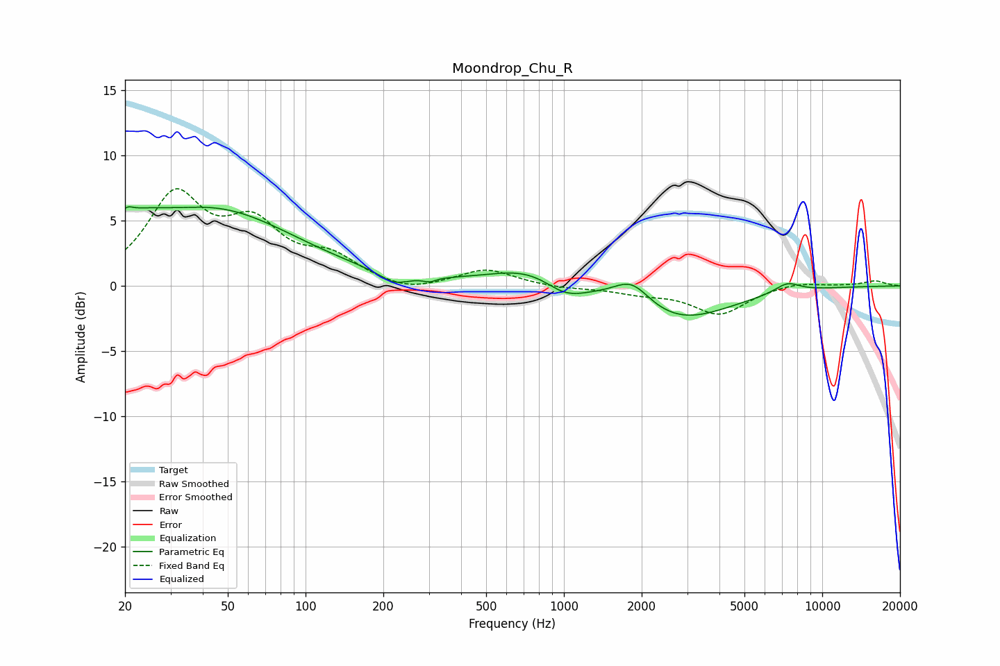

# Moondrop_Chu_R
See [usage instructions](https://github.com/jaakkopasanen/AutoEq#usage) for more options and info.

### Parametric EQs
Apply preamp of -6.2 dB when using parametric equalizer.

|   # | Type    |   Fc (Hz) |    Q |   Gain (dB) |
|-----|---------|-----------|------|-------------|
|   1 | Peaking |        20 | 5.22 |         0.9 |
|   2 | Peaking |        22 | 1.37 |         1.7 |
|   3 | Peaking |        45 | 0.45 |         5.6 |
|   4 | Peaking |       220 | 2.45 |        -0.9 |
|   5 | Peaking |       302 | 5.68 |        -0.3 |
|   6 | Peaking |       765 | 0.87 |         1.6 |
|   7 | Peaking |      1007 | 1.67 |        -1.4 |
|   8 | Peaking |      1833 | 1.97 |         1.9 |
|   9 | Peaking |      2751 | 0.71 |        -2.7 |
|  10 | Peaking |      7324 | 2.72 |         0.8 |

### Fixed Band EQs
When using fixed band (also called graphic) equalizer, apply preamp of **-7.5 dB** (if available) and set gains manually with these parameters.

|   # | Type    |   Fc (Hz) |    Q |   Gain (dB) |
|-----|---------|-----------|------|-------------|
|   1 | Peaking |        31 | 1.41 |         6.6 |
|   2 | Peaking |        62 | 1.41 |         4.1 |
|   3 | Peaking |       125 | 1.41 |         1.9 |
|   4 | Peaking |       250 | 1.41 |        -0.6 |
|   5 | Peaking |       500 | 1.41 |         1.3 |
|   6 | Peaking |      1000 | 1.41 |        -0.2 |
|   7 | Peaking |      2000 | 1.41 |        -0.5 |
|   8 | Peaking |      4000 | 1.41 |        -2.1 |
|   9 | Peaking |      8000 | 1.41 |         0.4 |
|  10 | Peaking |     16000 | 1.41 |         0.4 |

### Graphs

