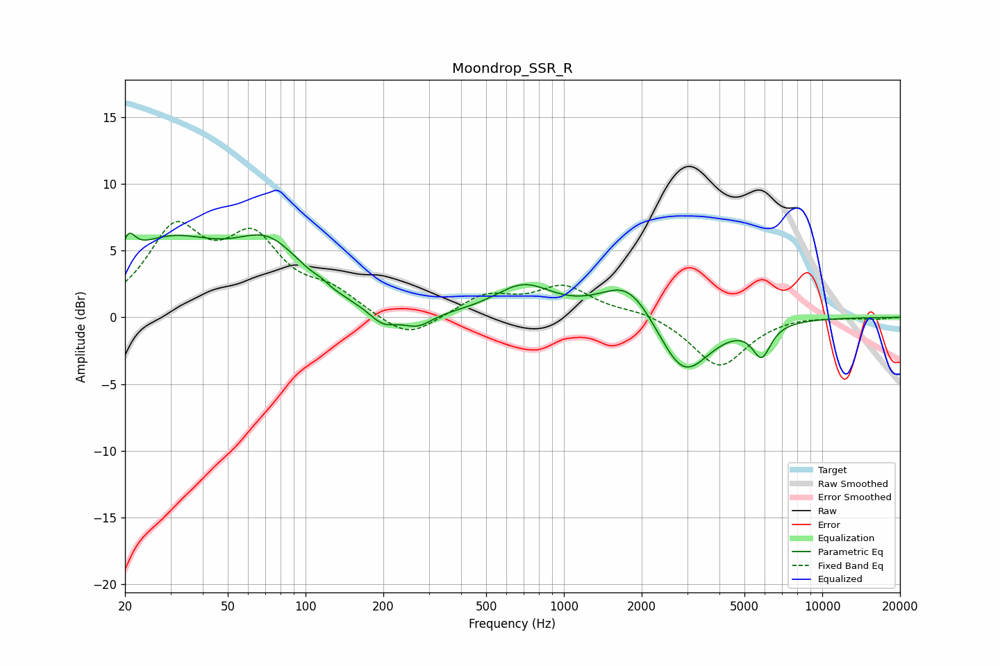

# Moondrop_SSR_R
See [usage instructions](https://github.com/jaakkopasanen/AutoEq#usage) for more options and info.

### Parametric EQs
Apply preamp of -6.4 dB when using parametric equalizer.

|   # | Type    |   Fc (Hz) |    Q |   Gain (dB) |
|-----|---------|-----------|------|-------------|
|   1 | Peaking |        21 | 5.85 |         1.6 |
|   2 | Peaking |        29 | 0.66 |         5.3 |
|   3 | Peaking |        72 | 1.05 |         4.2 |
|   4 | Peaking |       115 | 5.67 |         0.2 |
|   5 | Peaking |       200 | 2.65 |        -1.1 |
|   6 | Peaking |       271 | 2.38 |        -1.1 |
|   7 | Peaking |       697 | 1.27 |         2.3 |
|   8 | Peaking |      1786 | 1.31 |         3.1 |
|   9 | Peaking |      2898 | 1.39 |        -4.8 |
|  10 | Peaking |      5826 | 3.88 |        -2.4 |

### Fixed Band EQs
When using fixed band (also called graphic) equalizer, apply preamp of **-7.3 dB** (if available) and set gains manually with these parameters.

|   # | Type    |   Fc (Hz) |    Q |   Gain (dB) |
|-----|---------|-----------|------|-------------|
|   1 | Peaking |        31 | 1.41 |         6.1 |
|   2 | Peaking |        62 | 1.41 |         5.2 |
|   3 | Peaking |       125 | 1.41 |         1.6 |
|   4 | Peaking |       250 | 1.41 |        -1.8 |
|   5 | Peaking |       500 | 1.41 |         1.6 |
|   6 | Peaking |      1000 | 1.41 |         2.2 |
|   7 | Peaking |      2000 | 1.41 |         0.5 |
|   8 | Peaking |      4000 | 1.41 |        -3.7 |
|   9 | Peaking |      8000 | 1.41 |         0.2 |
|  10 | Peaking |     16000 | 1.41 |        -0.1 |

### Graphs

