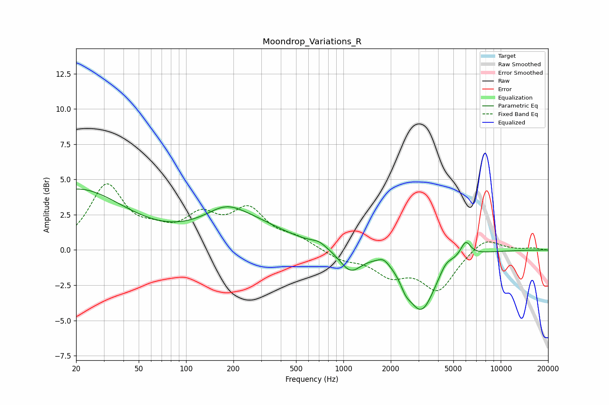

# Moondrop_Variations_R
See [usage instructions](https://github.com/jaakkopasanen/AutoEq#usage) for more options and info.

### Parametric EQs
Apply preamp of -4.4 dB when using parametric equalizer.

|   # | Type    |   Fc (Hz) |    Q |   Gain (dB) |
|-----|---------|-----------|------|-------------|
|   1 | Peaking |        20 | 0.46 |         4.3 |
|   2 | Peaking |       178 | 1.28 |         0.8 |
|   3 | Peaking |       218 | 0.55 |         2.1 |
|   4 | Peaking |       699 | 3.05 |         0.3 |
|   5 | Peaking |      1107 | 2.06 |        -1.5 |
|   6 | Peaking |      1801 | 3.86 |         0.4 |
|   7 | Peaking |      2488 | 4.49 |        -0.6 |
|   8 | Peaking |      3127 | 1.58 |        -4.2 |
|   9 | Peaking |      4491 | 3.56 |         0.6 |
|  10 | Peaking |      5986 | 4.24 |         1.1 |

### Fixed Band EQs
When using fixed band (also called graphic) equalizer, apply preamp of **-4.8 dB** (if available) and set gains manually with these parameters.

|   # | Type    |   Fc (Hz) |    Q |   Gain (dB) |
|-----|---------|-----------|------|-------------|
|   1 | Peaking |        31 | 1.41 |         4.4 |
|   2 | Peaking |        62 | 1.41 |         0.9 |
|   3 | Peaking |       125 | 1.41 |         2.1 |
|   4 | Peaking |       250 | 1.41 |         2.6 |
|   5 | Peaking |       500 | 1.41 |         0.7 |
|   6 | Peaking |      1000 | 1.41 |        -0.6 |
|   7 | Peaking |      2000 | 1.41 |        -1.6 |
|   8 | Peaking |      4000 | 1.41 |        -2.7 |
|   9 | Peaking |      8000 | 1.41 |         1   |
|  10 | Peaking |     16000 | 1.41 |         0.1 |

### Graphs

