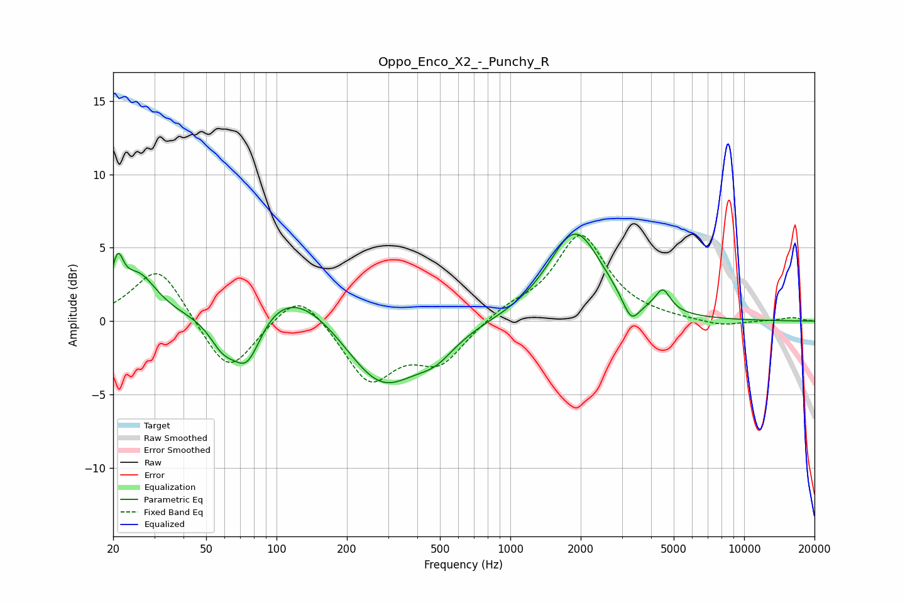

# Oppo_Enco_X2_-_Punchy_R
See [usage instructions](https://github.com/jaakkopasanen/AutoEq#usage) for more options and info.

### Parametric EQs
Apply preamp of -6.0 dB when using parametric equalizer.

|   # | Type    |   Fc (Hz) |    Q |   Gain (dB) |
|-----|---------|-----------|------|-------------|
|   1 | Peaking |        21 | 5.95 |         2.7 |
|   2 | Peaking |        26 | 1.81 |         2.9 |
|   3 | Peaking |        59 | 2.44 |        -1.9 |
|   4 | Peaking |        75 | 2.27 |        -3.6 |
|   5 | Peaking |       116 | 0.73 |         2.9 |
|   6 | Peaking |       280 | 0.89 |        -4.8 |
|   7 | Peaking |       480 | 1.71 |        -1.3 |
|   8 | Peaking |      1894 | 1.24 |         6.1 |
|   9 | Peaking |      3288 | 3.83 |        -1.7 |
|  10 | Peaking |      4493 | 4.33 |         1.5 |

### Fixed Band EQs
When using fixed band (also called graphic) equalizer, apply preamp of **-5.9 dB** (if available) and set gains manually with these parameters.

|   # | Type    |   Fc (Hz) |    Q |   Gain (dB) |
|-----|---------|-----------|------|-------------|
|   1 | Peaking |        31 | 1.41 |         3.9 |
|   2 | Peaking |        62 | 1.41 |        -3.8 |
|   3 | Peaking |       125 | 1.41 |         2.4 |
|   4 | Peaking |       250 | 1.41 |        -4   |
|   5 | Peaking |       500 | 1.41 |        -2.7 |
|   6 | Peaking |      1000 | 1.41 |         0.8 |
|   7 | Peaking |      2000 | 1.41 |         5.8 |
|   8 | Peaking |      4000 | 1.41 |         0.1 |
|   9 | Peaking |      8000 | 1.41 |        -0.4 |
|  10 | Peaking |     16000 | 1.41 |         0.2 |

### Graphs

