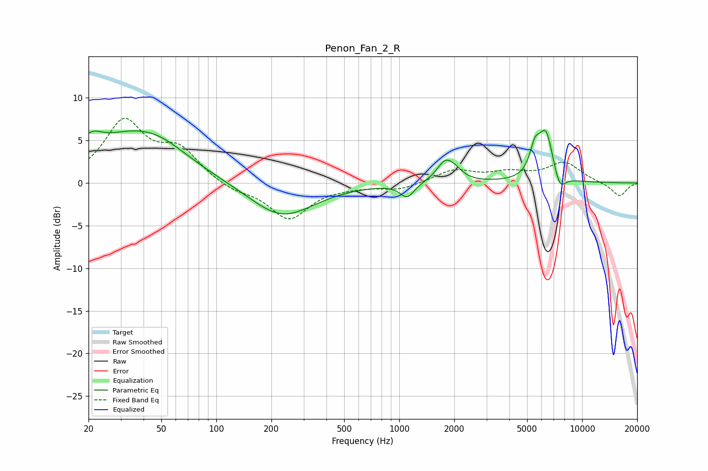

# Penon_Fan_2_R
See [usage instructions](https://github.com/jaakkopasanen/AutoEq#usage) for more options and info.

### Parametric EQs
Apply preamp of -6.3 dB when using parametric equalizer.

|   # | Type    |   Fc (Hz) |    Q |   Gain (dB) |
|-----|---------|-----------|------|-------------|
|   1 | Peaking |        21 | 2.57 |         1.9 |
|   2 | Peaking |        34 | 0.55 |         5.3 |
|   3 | Peaking |        50 | 1.02 |         1.1 |
|   4 | Peaking |       228 | 0.81 |        -4.1 |
|   5 | Peaking |      1105 | 3.67 |        -1.6 |
|   6 | Peaking |      1789 | 2.96 |         2.4 |
|   7 | Peaking |      2031 | 3.28 |         0.7 |
|   8 | Peaking |      5515 | 5.1  |         2.8 |
|   9 | Peaking |      6330 | 3.36 |         5.8 |
|  10 | Peaking |      7537 | 4.22 |        -2.1 |

### Fixed Band EQs
When using fixed band (also called graphic) equalizer, apply preamp of **-7.7 dB** (if available) and set gains manually with these parameters.

|   # | Type    |   Fc (Hz) |    Q |   Gain (dB) |
|-----|---------|-----------|------|-------------|
|   1 | Peaking |        31 | 1.41 |         7   |
|   2 | Peaking |        62 | 1.41 |         3.5 |
|   3 | Peaking |       125 | 1.41 |        -0.9 |
|   4 | Peaking |       250 | 1.41 |        -4.2 |
|   5 | Peaking |       500 | 1.41 |        -0.3 |
|   6 | Peaking |      1000 | 1.41 |        -0.8 |
|   7 | Peaking |      2000 | 1.41 |         1.5 |
|   8 | Peaking |      4000 | 1.41 |         1   |
|   9 | Peaking |      8000 | 1.41 |         2.3 |
|  10 | Peaking |     16000 | 1.41 |        -1.6 |

### Graphs

