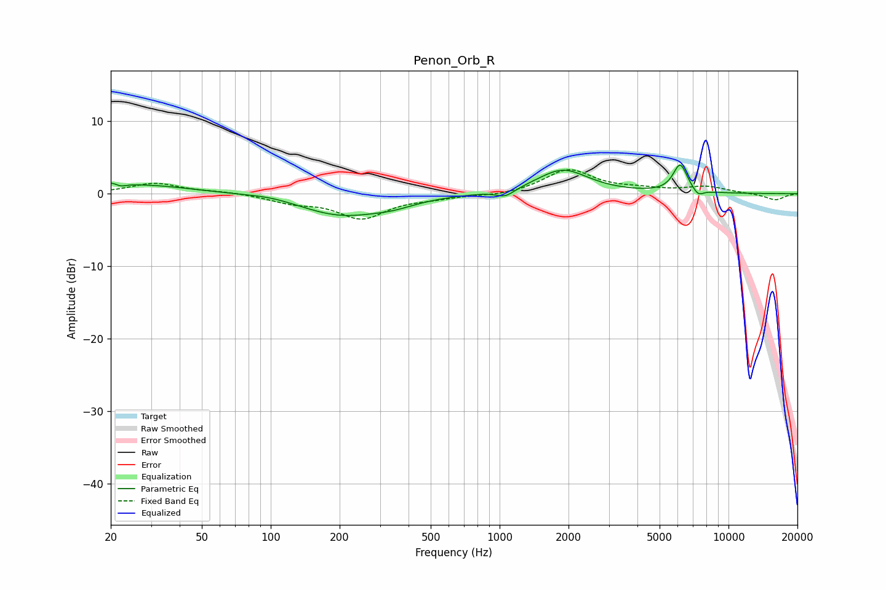

# Penon_Orb_R
See [usage instructions](https://github.com/jaakkopasanen/AutoEq#usage) for more options and info.

### Parametric EQs
Apply preamp of -4.0 dB when using parametric equalizer.

|   # | Type    |   Fc (Hz) |    Q |   Gain (dB) |
|-----|---------|-----------|------|-------------|
|   1 | Peaking |        21 | 3.06 |         1.1 |
|   2 | Peaking |        22 | 4.84 |        -0.9 |
|   3 | Peaking |        29 | 0.65 |         1.1 |
|   4 | Peaking |       100 | 1.36 |         0.4 |
|   5 | Peaking |       204 | 0.76 |        -2.9 |
|   6 | Peaking |       345 | 1.48 |        -0.7 |
|   7 | Peaking |      1060 | 3.53 |        -1   |
|   8 | Peaking |      1886 | 1.27 |         3.3 |
|   9 | Peaking |      6149 | 4.45 |         3.9 |
|  10 | Peaking |      7376 | 5.98 |        -0.9 |

### Fixed Band EQs
When using fixed band (also called graphic) equalizer, apply preamp of **-3.4 dB** (if available) and set gains manually with these parameters.

|   # | Type    |   Fc (Hz) |    Q |   Gain (dB) |
|-----|---------|-----------|------|-------------|
|   1 | Peaking |        31 | 1.41 |         1.4 |
|   2 | Peaking |        62 | 1.41 |         0.3 |
|   3 | Peaking |       125 | 1.41 |        -1.1 |
|   4 | Peaking |       250 | 1.41 |        -3.3 |
|   5 | Peaking |       500 | 1.41 |        -0.5 |
|   6 | Peaking |      1000 | 1.41 |        -0.3 |
|   7 | Peaking |      2000 | 1.41 |         3.3 |
|   8 | Peaking |      4000 | 1.41 |         0.5 |
|   9 | Peaking |      8000 | 1.41 |         0.9 |
|  10 | Peaking |     16000 | 1.41 |        -0.9 |

### Graphs

