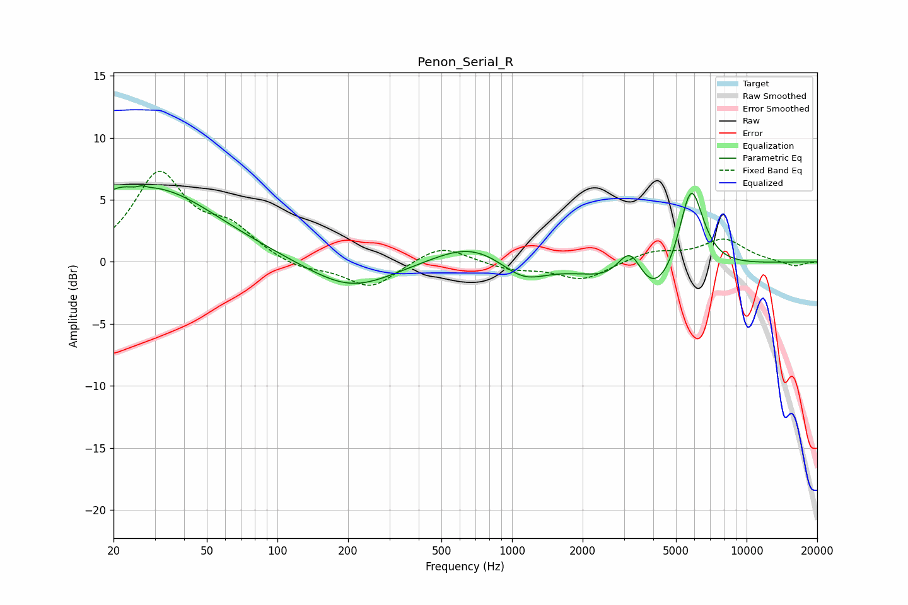

# Penon_Serial_R
See [usage instructions](https://github.com/jaakkopasanen/AutoEq#usage) for more options and info.

### Parametric EQs
Apply preamp of -6.2 dB when using parametric equalizer.

|   # | Type    |   Fc (Hz) |    Q |   Gain (dB) |
|-----|---------|-----------|------|-------------|
|   1 | Peaking |        20 | 1.56 |         1.2 |
|   2 | Peaking |        26 | 5.16 |        -1.6 |
|   3 | Peaking |        26 | 5.86 |         1.5 |
|   4 | Peaking |        30 | 0.52 |         5.7 |
|   5 | Peaking |       205 | 0.77 |        -2.4 |
|   6 | Peaking |       672 | 0.88 |         1.7 |
|   7 | Peaking |      1116 | 1.44 |        -1.6 |
|   8 | Peaking |      3198 | 2.4  |         3.9 |
|   9 | Peaking |      3815 | 0.97 |        -4.6 |
|  10 | Peaking |      5794 | 2.52 |         7.7 |

### Fixed Band EQs
When using fixed band (also called graphic) equalizer, apply preamp of **-7.4 dB** (if available) and set gains manually with these parameters.

|   # | Type    |   Fc (Hz) |    Q |   Gain (dB) |
|-----|---------|-----------|------|-------------|
|   1 | Peaking |        31 | 1.41 |         6.9 |
|   2 | Peaking |        62 | 1.41 |         2.3 |
|   3 | Peaking |       125 | 1.41 |        -0.7 |
|   4 | Peaking |       250 | 1.41 |        -2.1 |
|   5 | Peaking |       500 | 1.41 |         1.4 |
|   6 | Peaking |      1000 | 1.41 |        -0.6 |
|   7 | Peaking |      2000 | 1.41 |        -1.5 |
|   8 | Peaking |      4000 | 1.41 |         0.8 |
|   9 | Peaking |      8000 | 1.41 |         1.8 |
|  10 | Peaking |     16000 | 1.41 |        -0.4 |

### Graphs

