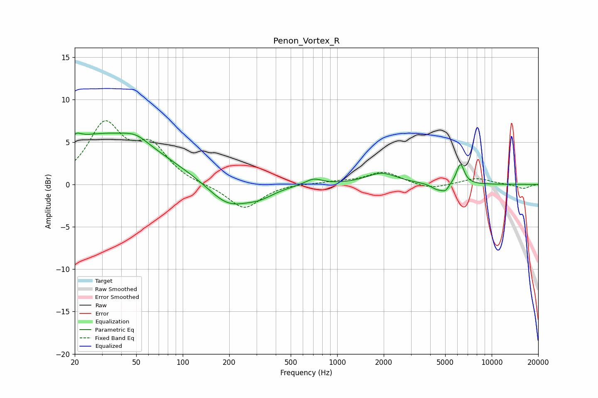

# Penon_Vortex_R
See [usage instructions](https://github.com/jaakkopasanen/AutoEq#usage) for more options and info.

### Parametric EQs
Apply preamp of -6.2 dB when using parametric equalizer.

|   # | Type    |   Fc (Hz) |    Q |   Gain (dB) |
|-----|---------|-----------|------|-------------|
|   1 | Peaking |        21 | 4.67 |         0.7 |
|   2 | Peaking |        31 | 0.37 |         5.8 |
|   3 | Peaking |        50 | 1.81 |         0.9 |
|   4 | Peaking |       196 | 1.06 |        -2.8 |
|   5 | Peaking |       315 | 1.51 |        -1   |
|   6 | Peaking |       702 | 2.52 |         0.8 |
|   7 | Peaking |      1941 | 1.42 |         1.3 |
|   8 | Peaking |      4448 | 3.5  |        -0.7 |
|   9 | Peaking |      5014 | 5.76 |        -0.7 |
|  10 | Peaking |      6272 | 5.37 |         2.4 |

### Fixed Band EQs
When using fixed band (also called graphic) equalizer, apply preamp of **-7.6 dB** (if available) and set gains manually with these parameters.

|   # | Type    |   Fc (Hz) |    Q |   Gain (dB) |
|-----|---------|-----------|------|-------------|
|   1 | Peaking |        31 | 1.41 |         6.8 |
|   2 | Peaking |        62 | 1.41 |         4   |
|   3 | Peaking |       125 | 1.41 |        -0.1 |
|   4 | Peaking |       250 | 1.41 |        -2.9 |
|   5 | Peaking |       500 | 1.41 |         0.1 |
|   6 | Peaking |      1000 | 1.41 |         0.3 |
|   7 | Peaking |      2000 | 1.41 |         1.5 |
|   8 | Peaking |      4000 | 1.41 |        -0.6 |
|   9 | Peaking |      8000 | 1.41 |         0.7 |
|  10 | Peaking |     16000 | 1.41 |        -0.5 |

### Graphs

