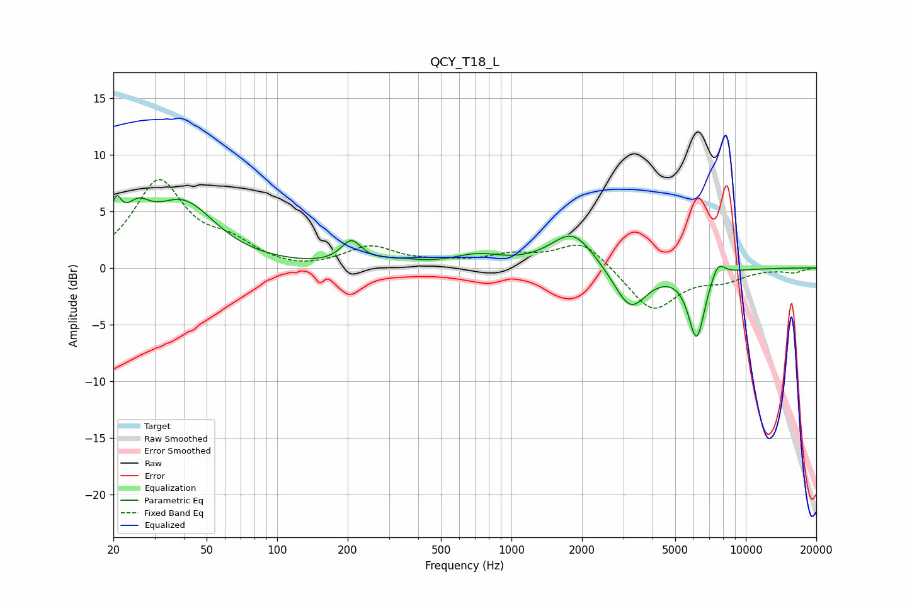

# QCY_T18_L
See [usage instructions](https://github.com/jaakkopasanen/AutoEq#usage) for more options and info.

### Parametric EQs
Apply preamp of -6.5 dB when using parametric equalizer.

|   # | Type    |   Fc (Hz) |    Q |   Gain (dB) |
|-----|---------|-----------|------|-------------|
|   1 | Peaking |        20 | 5.8  |         3.2 |
|   2 | Peaking |        25 | 2.5  |         2.8 |
|   3 | Peaking |        40 | 1.02 |         5.5 |
|   4 | Peaking |       207 | 3.24 |         2   |
|   5 | Peaking |       325 | 1.75 |         0.4 |
|   6 | Peaking |       715 | 1.34 |         1   |
|   7 | Peaking |      1826 | 1.52 |         3.2 |
|   8 | Peaking |      3216 | 1.99 |        -3.8 |
|   9 | Peaking |      6168 | 3.85 |        -6   |
|  10 | Peaking |      7611 | 4.52 |         1.5 |

### Fixed Band EQs
When using fixed band (also called graphic) equalizer, apply preamp of **-7.9 dB** (if available) and set gains manually with these parameters.

|   # | Type    |   Fc (Hz) |    Q |   Gain (dB) |
|-----|---------|-----------|------|-------------|
|   1 | Peaking |        31 | 1.41 |         7.5 |
|   2 | Peaking |        62 | 1.41 |         1.7 |
|   3 | Peaking |       125 | 1.41 |        -0.3 |
|   4 | Peaking |       250 | 1.41 |         1.8 |
|   5 | Peaking |       500 | 1.41 |         0.3 |
|   6 | Peaking |      1000 | 1.41 |         1   |
|   7 | Peaking |      2000 | 1.41 |         2.4 |
|   8 | Peaking |      4000 | 1.41 |        -3.9 |
|   9 | Peaking |      8000 | 1.41 |        -0.9 |
|  10 | Peaking |     16000 | 1.41 |        -0.4 |

### Graphs

