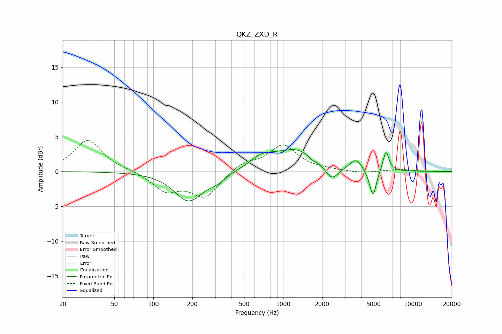

# QKZ_ZXD_R
See [usage instructions](https://github.com/jaakkopasanen/AutoEq#usage) for more options and info.

### Parametric EQs
Apply preamp of -3.3 dB when using parametric equalizer.

|   # | Type    |   Fc (Hz) |    Q |   Gain (dB) |
|-----|---------|-----------|------|-------------|
|   1 | Peaking |       187 | 1.3  |        -4.2 |
|   2 | Peaking |       310 | 2.17 |        -0.9 |
|   3 | Peaking |       686 | 1.61 |         1.4 |
|   4 | Peaking |      1312 | 0.77 |         3.3 |
|   5 | Peaking |      1684 | 3.53 |        -0.7 |
|   6 | Peaking |      2369 | 2.49 |        -2.5 |
|   7 | Peaking |      3647 | 3.1  |         1.5 |
|   8 | Peaking |      4798 | 4.13 |        -0.9 |
|   9 | Peaking |      4958 | 5.74 |        -3.2 |
|  10 | Peaking |      6216 | 5.99 |         2.9 |

### Fixed Band EQs
When using fixed band (also called graphic) equalizer, apply preamp of **-4.6 dB** (if available) and set gains manually with these parameters.

|   # | Type    |   Fc (Hz) |    Q |   Gain (dB) |
|-----|---------|-----------|------|-------------|
|   1 | Peaking |        31 | 1.41 |         4.6 |
|   2 | Peaking |        62 | 1.41 |         0.2 |
|   3 | Peaking |       125 | 1.41 |        -2.6 |
|   4 | Peaking |       250 | 1.41 |        -3.6 |
|   5 | Peaking |       500 | 1.41 |         1.3 |
|   6 | Peaking |      1000 | 1.41 |         3.7 |
|   7 | Peaking |      2000 | 1.41 |         0.2 |
|   8 | Peaking |      4000 | 1.41 |        -0.3 |
|   9 | Peaking |      8000 | 1.41 |         0.3 |
|  10 | Peaking |     16000 | 1.41 |         0   |

### Graphs

