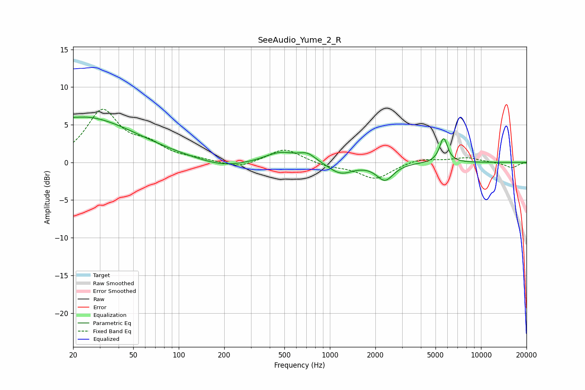

# SeeAudio_Yume_2_R
See [usage instructions](https://github.com/jaakkopasanen/AutoEq#usage) for more options and info.

### Parametric EQs
Apply preamp of -6.1 dB when using parametric equalizer.

|   # | Type    |   Fc (Hz) |    Q |   Gain (dB) |
|-----|---------|-----------|------|-------------|
|   1 | Peaking |        21 | 5.96 |         3.2 |
|   2 | Peaking |        21 | 5.86 |        -3.2 |
|   3 | Peaking |        21 | 0.4  |         5.1 |
|   4 | Peaking |        31 | 0.35 |         1.1 |
|   5 | Peaking |       196 | 0.89 |        -0.9 |
|   6 | Peaking |       468 | 1.39 |         1.4 |
|   7 | Peaking |       710 | 2.48 |         1.1 |
|   8 | Peaking |      1179 | 1.76 |        -1.5 |
|   9 | Peaking |      2316 | 2.59 |        -2.3 |
|  10 | Peaking |      5656 | 5.22 |         3.2 |

### Fixed Band EQs
When using fixed band (also called graphic) equalizer, apply preamp of **-7.2 dB** (if available) and set gains manually with these parameters.

|   # | Type    |   Fc (Hz) |    Q |   Gain (dB) |
|-----|---------|-----------|------|-------------|
|   1 | Peaking |        31 | 1.41 |         6.7 |
|   2 | Peaking |        62 | 1.41 |         1.9 |
|   3 | Peaking |       125 | 1.41 |         0.3 |
|   4 | Peaking |       250 | 1.41 |        -0.8 |
|   5 | Peaking |       500 | 1.41 |         1.9 |
|   6 | Peaking |      1000 | 1.41 |        -0.5 |
|   7 | Peaking |      2000 | 1.41 |        -2.2 |
|   8 | Peaking |      4000 | 1.41 |         0.6 |
|   9 | Peaking |      8000 | 1.41 |         0.6 |
|  10 | Peaking |     16000 | 1.41 |        -0.7 |

### Graphs

