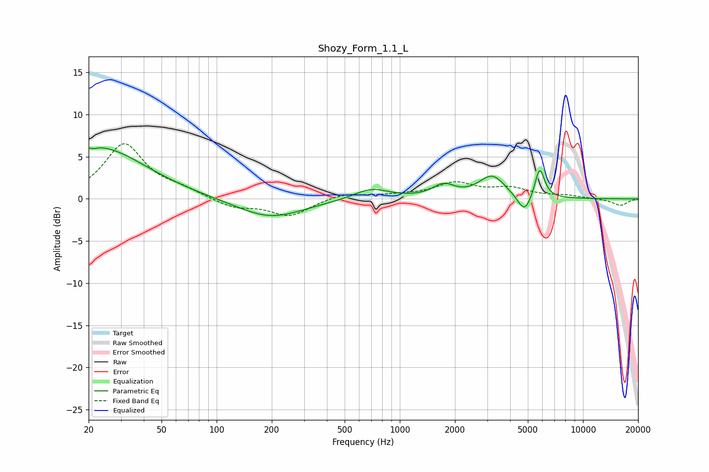

# Shozy_Form_1.1_L
See [usage instructions](https://github.com/jaakkopasanen/AutoEq#usage) for more options and info.

### Parametric EQs
Apply preamp of -6.2 dB when using parametric equalizer.

|   # | Type    |   Fc (Hz) |    Q |   Gain (dB) |
|-----|---------|-----------|------|-------------|
|   1 | Peaking |        20 | 0.9  |         1.3 |
|   2 | Peaking |        21 | 5.63 |         3.1 |
|   3 | Peaking |        21 | 5.97 |        -3.1 |
|   4 | Peaking |        25 | 0.56 |         4.9 |
|   5 | Peaking |       196 | 0.78 |        -2.3 |
|   6 | Peaking |       699 | 1.47 |         1.3 |
|   7 | Peaking |      1732 | 2.4  |         1.4 |
|   8 | Peaking |      3193 | 1.96 |         2.7 |
|   9 | Peaking |      4800 | 3.61 |        -2.3 |
|  10 | Peaking |      5800 | 5.21 |         3.7 |

### Fixed Band EQs
When using fixed band (also called graphic) equalizer, apply preamp of **-6.6 dB** (if available) and set gains manually with these parameters.

|   # | Type    |   Fc (Hz) |    Q |   Gain (dB) |
|-----|---------|-----------|------|-------------|
|   1 | Peaking |        31 | 1.41 |         6.4 |
|   2 | Peaking |        62 | 1.41 |         0.9 |
|   3 | Peaking |       125 | 1.41 |        -1   |
|   4 | Peaking |       250 | 1.41 |        -2   |
|   5 | Peaking |       500 | 1.41 |         0.7 |
|   6 | Peaking |      1000 | 1.41 |         0.3 |
|   7 | Peaking |      2000 | 1.41 |         1.8 |
|   8 | Peaking |      4000 | 1.41 |         1.1 |
|   9 | Peaking |      8000 | 1.41 |         0.3 |
|  10 | Peaking |     16000 | 1.41 |        -0.8 |

### Graphs

