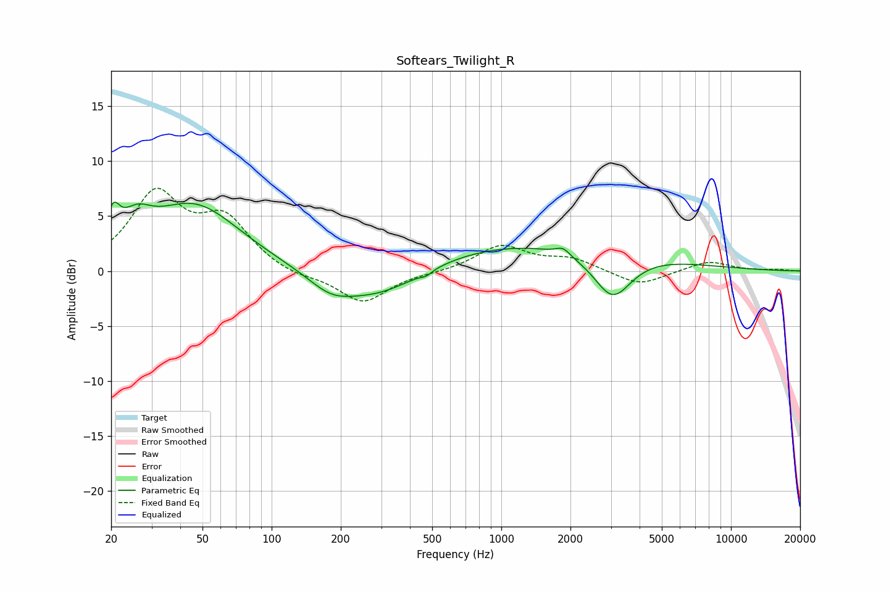

# Softears_Twilight_R
See [usage instructions](https://github.com/jaakkopasanen/AutoEq#usage) for more options and info.

### Parametric EQs
Apply preamp of -6.4 dB when using parametric equalizer.

|   # | Type    |   Fc (Hz) |    Q |   Gain (dB) |
|-----|---------|-----------|------|-------------|
|   1 | Peaking |        20 | 5.08 |         2.8 |
|   2 | Peaking |        26 | 2.17 |         2.3 |
|   3 | Peaking |        46 | 0.7  |         6   |
|   4 | Peaking |       180 | 1.53 |        -1.3 |
|   5 | Peaking |       288 | 0.67 |        -3.2 |
|   6 | Peaking |       471 | 5.94 |        -0.3 |
|   7 | Peaking |      1287 | 0.25 |         2.8 |
|   8 | Peaking |      1856 | 4.86 |         0.7 |
|   9 | Peaking |      2272 | 0.73 |        -0.2 |
|  10 | Peaking |      3052 | 1.71 |        -4.2 |

### Fixed Band EQs
When using fixed band (also called graphic) equalizer, apply preamp of **-7.6 dB** (if available) and set gains manually with these parameters.

|   # | Type    |   Fc (Hz) |    Q |   Gain (dB) |
|-----|---------|-----------|------|-------------|
|   1 | Peaking |        31 | 1.41 |         6.8 |
|   2 | Peaking |        62 | 1.41 |         4.3 |
|   3 | Peaking |       125 | 1.41 |        -0.6 |
|   4 | Peaking |       250 | 1.41 |        -2.9 |
|   5 | Peaking |       500 | 1.41 |        -0.1 |
|   6 | Peaking |      1000 | 1.41 |         2.3 |
|   7 | Peaking |      2000 | 1.41 |         1.1 |
|   8 | Peaking |      4000 | 1.41 |        -1.4 |
|   9 | Peaking |      8000 | 1.41 |         0.9 |
|  10 | Peaking |     16000 | 1.41 |         0.1 |

### Graphs

