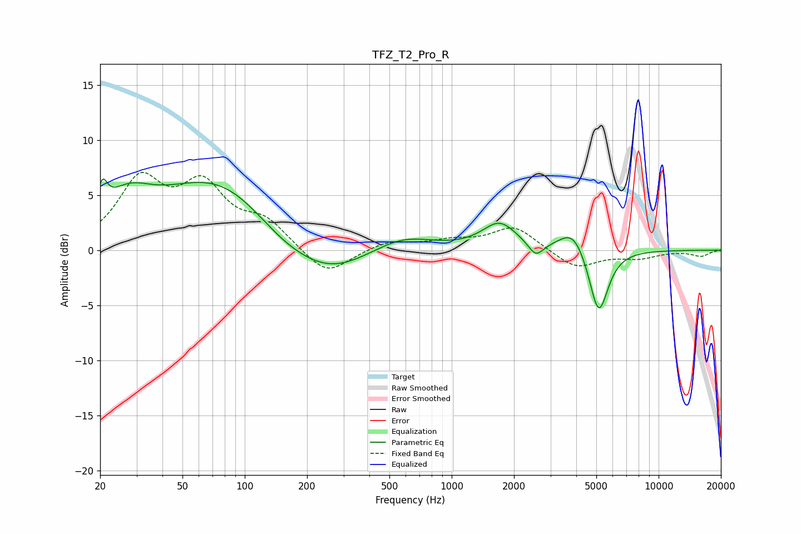

# TFZ_T2_Pro_R
See [usage instructions](https://github.com/jaakkopasanen/AutoEq#usage) for more options and info.

### Parametric EQs
Apply preamp of -6.6 dB when using parametric equalizer.

|   # | Type    |   Fc (Hz) |    Q |   Gain (dB) |
|-----|---------|-----------|------|-------------|
|   1 | Peaking |        21 | 6    |         2.4 |
|   2 | Peaking |        27 | 1.21 |         3.1 |
|   3 | Peaking |        78 | 0.46 |         6.9 |
|   4 | Peaking |       150 | 0.79 |        -2.3 |
|   5 | Peaking |       257 | 0.76 |        -2.7 |
|   6 | Peaking |       581 | 0.98 |         1.4 |
|   7 | Peaking |      1704 | 1.71 |         2.4 |
|   8 | Peaking |      2551 | 3.92 |        -1.3 |
|   9 | Peaking |      3865 | 2.15 |         2.2 |
|  10 | Peaking |      5132 | 3.01 |        -6.1 |

### Fixed Band EQs
When using fixed band (also called graphic) equalizer, apply preamp of **-7.2 dB** (if available) and set gains manually with these parameters.

|   # | Type    |   Fc (Hz) |    Q |   Gain (dB) |
|-----|---------|-----------|------|-------------|
|   1 | Peaking |        31 | 1.41 |         6   |
|   2 | Peaking |        62 | 1.41 |         5.3 |
|   3 | Peaking |       125 | 1.41 |         2.3 |
|   4 | Peaking |       250 | 1.41 |        -2.5 |
|   5 | Peaking |       500 | 1.41 |         0.8 |
|   6 | Peaking |      1000 | 1.41 |         0.7 |
|   7 | Peaking |      2000 | 1.41 |         2.2 |
|   8 | Peaking |      4000 | 1.41 |        -1.7 |
|   9 | Peaking |      8000 | 1.41 |        -0.6 |
|  10 | Peaking |     16000 | 1.41 |        -0.5 |

### Graphs

