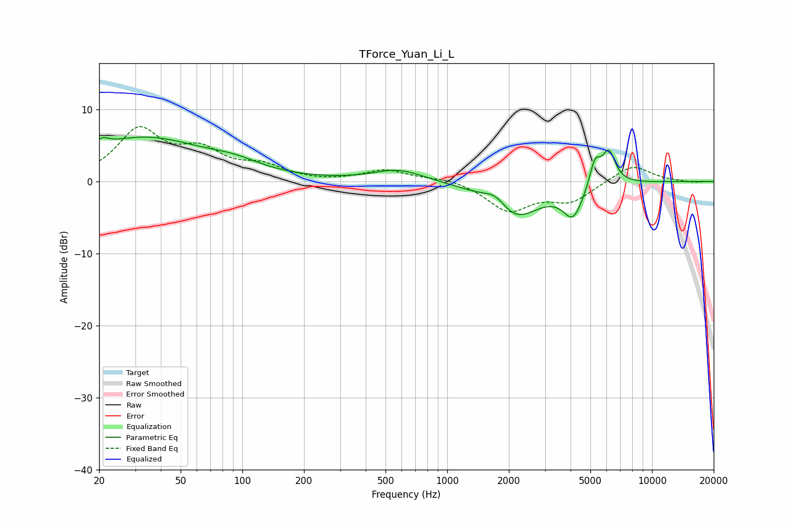

# TForce_Yuan_Li_L
See [usage instructions](https://github.com/jaakkopasanen/AutoEq#usage) for more options and info.

### Parametric EQs
Apply preamp of -6.2 dB when using parametric equalizer.

|   # | Type    |   Fc (Hz) |    Q |   Gain (dB) |
|-----|---------|-----------|------|-------------|
|   1 | Peaking |        21 | 5.34 |         3.5 |
|   2 | Peaking |        21 | 5.76 |        -2.5 |
|   3 | Peaking |        33 | 0.46 |         6   |
|   4 | Peaking |        92 | 1.11 |         1.1 |
|   5 | Peaking |       579 | 1.15 |         1.7 |
|   6 | Peaking |      1728 | 2.4  |         2.1 |
|   7 | Peaking |      2116 | 1.16 |        -5.4 |
|   8 | Peaking |      4117 | 2.87 |        -4.3 |
|   9 | Peaking |      5264 | 5.29 |         3.6 |
|  10 | Peaking |      6144 | 4.17 |         4.6 |

### Fixed Band EQs
When using fixed band (also called graphic) equalizer, apply preamp of **-7.7 dB** (if available) and set gains manually with these parameters.

|   # | Type    |   Fc (Hz) |    Q |   Gain (dB) |
|-----|---------|-----------|------|-------------|
|   1 | Peaking |        31 | 1.41 |         6.8 |
|   2 | Peaking |        62 | 1.41 |         3.6 |
|   3 | Peaking |       125 | 1.41 |         1.8 |
|   4 | Peaking |       250 | 1.41 |        -0.1 |
|   5 | Peaking |       500 | 1.41 |         1.5 |
|   6 | Peaking |      1000 | 1.41 |         0.5 |
|   7 | Peaking |      2000 | 1.41 |        -4   |
|   8 | Peaking |      4000 | 1.41 |        -2.6 |
|   9 | Peaking |      8000 | 1.41 |         2.4 |
|  10 | Peaking |     16000 | 1.41 |        -0.2 |

### Graphs

