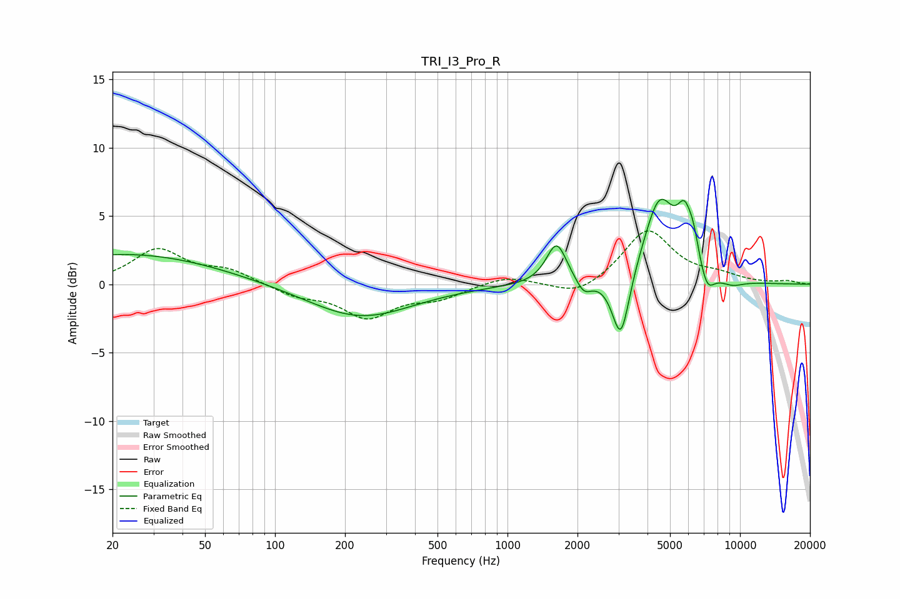

# TRI_I3_Pro_R
See [usage instructions](https://github.com/jaakkopasanen/AutoEq#usage) for more options and info.

### Parametric EQs
Apply preamp of -6.3 dB when using parametric equalizer.

|   # | Type    |   Fc (Hz) |    Q |   Gain (dB) |
|-----|---------|-----------|------|-------------|
|   1 | Peaking |        23 | 0.36 |         2.2 |
|   2 | Peaking |       232 | 0.63 |        -2.5 |
|   3 | Peaking |      1626 | 3.27 |         3   |
|   4 | Peaking |      2129 | 4.32 |        -1.1 |
|   5 | Peaking |      3073 | 3.8  |        -5   |
|   6 | Peaking |      4503 | 2.03 |         6.1 |
|   7 | Peaking |      5781 | 4.1  |         3.3 |
|   8 | Peaking |      6318 | 6    |         1.4 |
|   9 | Peaking |      7218 | 4.3  |        -1.6 |
|  10 | Peaking |      9231 | 2.53 |        -0.4 |

### Fixed Band EQs
When using fixed band (also called graphic) equalizer, apply preamp of **-4.0 dB** (if available) and set gains manually with these parameters.

|   # | Type    |   Fc (Hz) |    Q |   Gain (dB) |
|-----|---------|-----------|------|-------------|
|   1 | Peaking |        31 | 1.41 |         2.5 |
|   2 | Peaking |        62 | 1.41 |         0.9 |
|   3 | Peaking |       125 | 1.41 |        -0.8 |
|   4 | Peaking |       250 | 1.41 |        -2.3 |
|   5 | Peaking |       500 | 1.41 |        -0.9 |
|   6 | Peaking |      1000 | 1.41 |         0.7 |
|   7 | Peaking |      2000 | 1.41 |        -1   |
|   8 | Peaking |      4000 | 1.41 |         4   |
|   9 | Peaking |      8000 | 1.41 |         0.5 |
|  10 | Peaking |     16000 | 1.41 |         0.2 |

### Graphs

