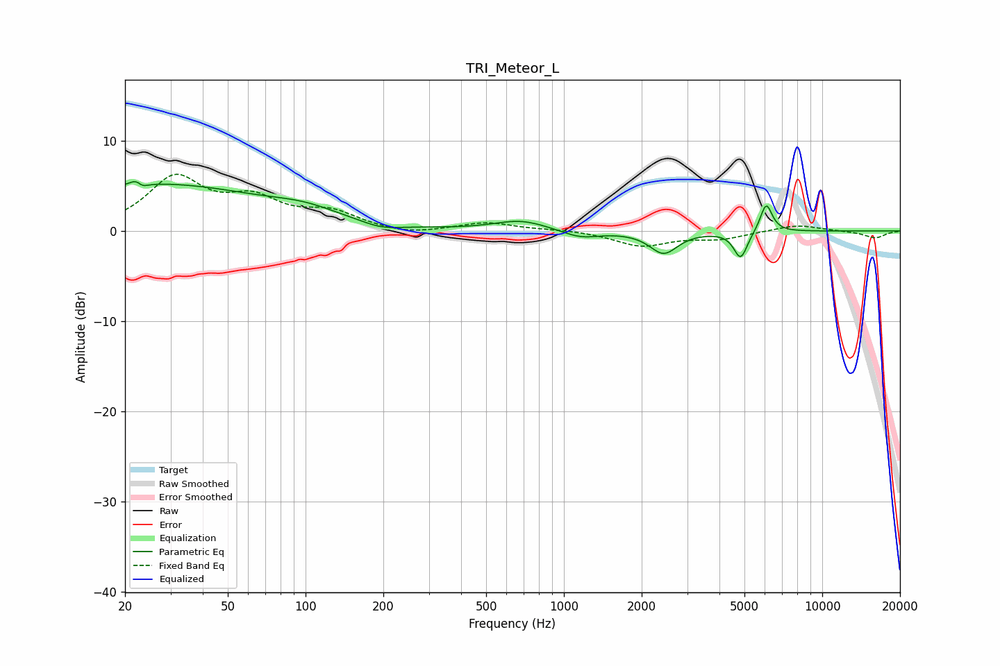

# TRI_Meteor_L
See [usage instructions](https://github.com/jaakkopasanen/AutoEq#usage) for more options and info.

### Parametric EQs
Apply preamp of -5.6 dB when using parametric equalizer.

|   # | Type    |   Fc (Hz) |    Q |   Gain (dB) |
|-----|---------|-----------|------|-------------|
|   1 | Peaking |        23 | 5.66 |         3.2 |
|   2 | Peaking |        23 | 5.87 |        -3.1 |
|   3 | Peaking |        26 | 0.33 |         5.1 |
|   4 | Peaking |       100 | 1.05 |         1.1 |
|   5 | Peaking |       196 | 1.87 |        -0.7 |
|   6 | Peaking |       681 | 1.36 |         1.2 |
|   7 | Peaking |      1161 | 1.94 |        -0.9 |
|   8 | Peaking |      2434 | 2.64 |        -2.4 |
|   9 | Peaking |      4832 | 5.34 |        -3   |
|  10 | Peaking |      6069 | 5.96 |         3.2 |

### Fixed Band EQs
When using fixed band (also called graphic) equalizer, apply preamp of **-6.4 dB** (if available) and set gains manually with these parameters.

|   # | Type    |   Fc (Hz) |    Q |   Gain (dB) |
|-----|---------|-----------|------|-------------|
|   1 | Peaking |        31 | 1.41 |         5.7 |
|   2 | Peaking |        62 | 1.41 |         3   |
|   3 | Peaking |       125 | 1.41 |         1.8 |
|   4 | Peaking |       250 | 1.41 |        -0.5 |
|   5 | Peaking |       500 | 1.41 |         0.9 |
|   6 | Peaking |      1000 | 1.41 |         0.2 |
|   7 | Peaking |      2000 | 1.41 |        -1.6 |
|   8 | Peaking |      4000 | 1.41 |        -0.8 |
|   9 | Peaking |      8000 | 1.41 |         0.7 |
|  10 | Peaking |     16000 | 1.41 |        -0.8 |

### Graphs

