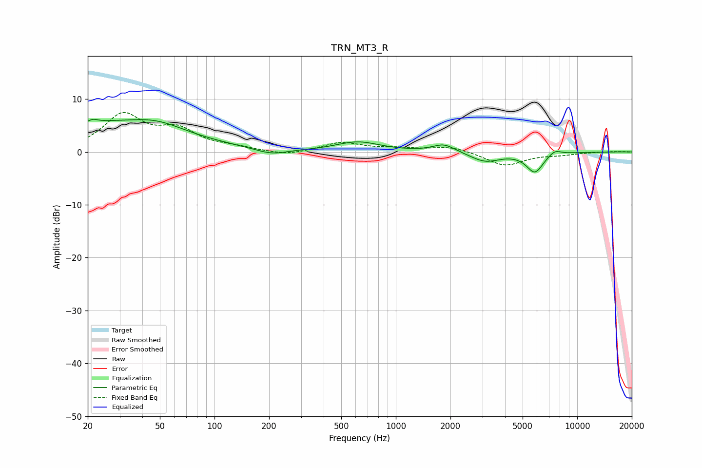

# TRN_MT3_R
See [usage instructions](https://github.com/jaakkopasanen/AutoEq#usage) for more options and info.

### Parametric EQs
Apply preamp of -6.3 dB when using parametric equalizer.

|   # | Type    |   Fc (Hz) |    Q |   Gain (dB) |
|-----|---------|-----------|------|-------------|
|   1 | Peaking |        22 | 5.91 |         3.2 |
|   2 | Peaking |        22 | 6    |        -2.7 |
|   3 | Peaking |        24 | 0.32 |         5.2 |
|   4 | Peaking |        48 | 1    |         1.7 |
|   5 | Peaking |       206 | 1.64 |        -1.1 |
|   6 | Peaking |       617 | 1.17 |         1.8 |
|   7 | Peaking |      1842 | 2.32 |         1.5 |
|   8 | Peaking |      3108 | 1.73 |        -1.8 |
|   9 | Peaking |      5841 | 2.96 |        -3.7 |
|  10 | Peaking |      7515 | 3.89 |         1   |

### Fixed Band EQs
When using fixed band (also called graphic) equalizer, apply preamp of **-7.6 dB** (if available) and set gains manually with these parameters.

|   # | Type    |   Fc (Hz) |    Q |   Gain (dB) |
|-----|---------|-----------|------|-------------|
|   1 | Peaking |        31 | 1.41 |         6.7 |
|   2 | Peaking |        62 | 1.41 |         3.7 |
|   3 | Peaking |       125 | 1.41 |         0.7 |
|   4 | Peaking |       250 | 1.41 |        -0.8 |
|   5 | Peaking |       500 | 1.41 |         1.7 |
|   6 | Peaking |      1000 | 1.41 |         0.6 |
|   7 | Peaking |      2000 | 1.41 |         1   |
|   8 | Peaking |      4000 | 1.41 |        -2.6 |
|   9 | Peaking |      8000 | 1.41 |        -0.4 |
|  10 | Peaking |     16000 | 1.41 |         0.1 |

### Graphs

