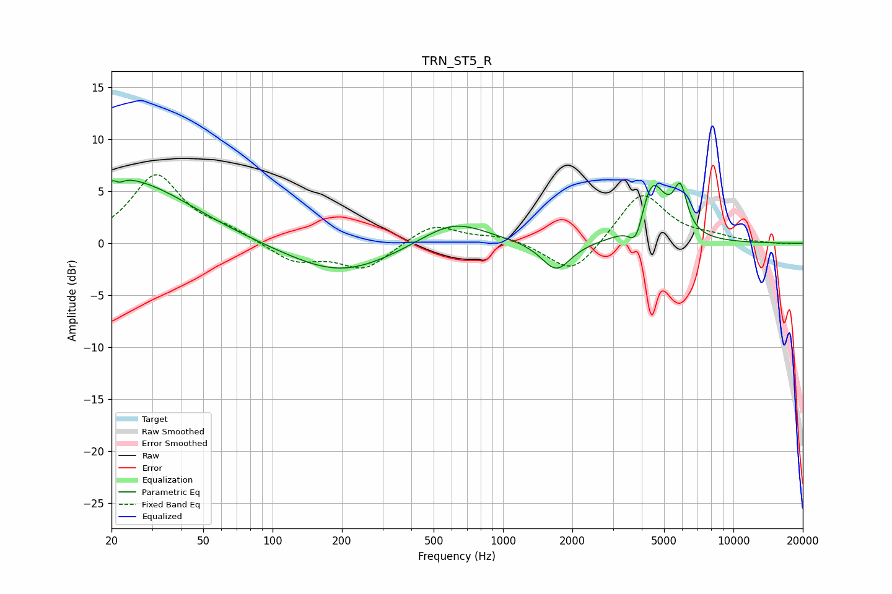

# TRN_ST5_R
See [usage instructions](https://github.com/jaakkopasanen/AutoEq#usage) for more options and info.

### Parametric EQs
Apply preamp of -6.2 dB when using parametric equalizer.

|   # | Type    |   Fc (Hz) |    Q |   Gain (dB) |
|-----|---------|-----------|------|-------------|
|   1 | Peaking |        20 | 1.48 |         1.6 |
|   2 | Peaking |        21 | 5.99 |         3.2 |
|   3 | Peaking |        21 | 5.97 |        -3.4 |
|   4 | Peaking |        27 | 0.57 |         5.1 |
|   5 | Peaking |       197 | 0.63 |        -3   |
|   6 | Peaking |       608 | 0.98 |         2.4 |
|   7 | Peaking |      1702 | 2.23 |        -2.8 |
|   8 | Peaking |      3791 | 4.35 |        -2.9 |
|   9 | Peaking |      4418 | 2.37 |         6.1 |
|  10 | Peaking |      5883 | 4.78 |         4.1 |

### Fixed Band EQs
When using fixed band (also called graphic) equalizer, apply preamp of **-6.7 dB** (if available) and set gains manually with these parameters.

|   # | Type    |   Fc (Hz) |    Q |   Gain (dB) |
|-----|---------|-----------|------|-------------|
|   1 | Peaking |        31 | 1.41 |         6.5 |
|   2 | Peaking |        62 | 1.41 |         1   |
|   3 | Peaking |       125 | 1.41 |        -1.8 |
|   4 | Peaking |       250 | 1.41 |        -2.5 |
|   5 | Peaking |       500 | 1.41 |         1.9 |
|   6 | Peaking |      1000 | 1.41 |         0.7 |
|   7 | Peaking |      2000 | 1.41 |        -3.2 |
|   8 | Peaking |      4000 | 1.41 |         5   |
|   9 | Peaking |      8000 | 1.41 |         0.5 |
|  10 | Peaking |     16000 | 1.41 |        -0.1 |

### Graphs

