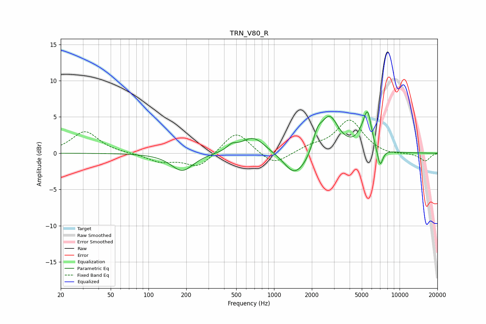

# TRN_V80_R
See [usage instructions](https://github.com/jaakkopasanen/AutoEq#usage) for more options and info.

### Parametric EQs
Apply preamp of -5.8 dB when using parametric equalizer.

|   # | Type    |   Fc (Hz) |    Q |   Gain (dB) |
|-----|---------|-----------|------|-------------|
|   1 | Peaking |       186 | 1.62 |        -2.5 |
|   2 | Peaking |       461 | 3.8  |         0.7 |
|   3 | Peaking |       681 | 1.48 |         2.3 |
|   4 | Peaking |      1458 | 1.67 |        -3.3 |
|   5 | Peaking |      1826 | 2.71 |        -0.7 |
|   6 | Peaking |      2214 | 3.87 |         1.9 |
|   7 | Peaking |      2761 | 1.94 |         5   |
|   8 | Peaking |      5175 | 2.73 |         1.9 |
|   9 | Peaking |      5580 | 4.74 |         3.9 |
|  10 | Peaking |      6989 | 5.97 |        -2.6 |

### Fixed Band EQs
When using fixed band (also called graphic) equalizer, apply preamp of **-4.7 dB** (if available) and set gains manually with these parameters.

|   # | Type    |   Fc (Hz) |    Q |   Gain (dB) |
|-----|---------|-----------|------|-------------|
|   1 | Peaking |        31 | 1.41 |         3   |
|   2 | Peaking |        62 | 1.41 |        -0   |
|   3 | Peaking |       125 | 1.41 |        -1.1 |
|   4 | Peaking |       250 | 1.41 |        -2   |
|   5 | Peaking |       500 | 1.41 |         3.2 |
|   6 | Peaking |      1000 | 1.41 |        -1.8 |
|   7 | Peaking |      2000 | 1.41 |         0.8 |
|   8 | Peaking |      4000 | 1.41 |         4.5 |
|   9 | Peaking |      8000 | 1.41 |        -0.3 |
|  10 | Peaking |     16000 | 1.41 |        -1.1 |

### Graphs

