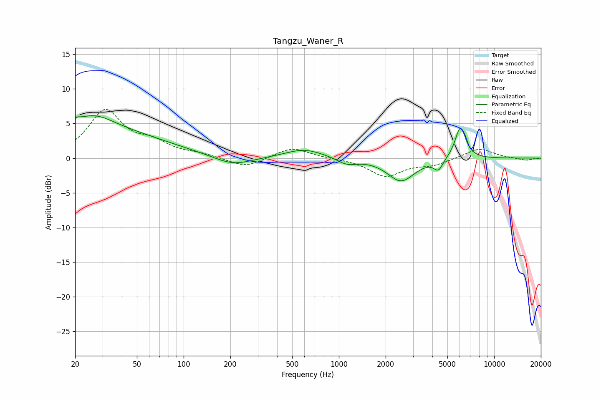

# Tangzu_Waner_R
See [usage instructions](https://github.com/jaakkopasanen/AutoEq#usage) for more options and info.

### Parametric EQs
Apply preamp of -6.2 dB when using parametric equalizer.

|   # | Type    |   Fc (Hz) |    Q |   Gain (dB) |
|-----|---------|-----------|------|-------------|
|   1 | Peaking |        20 | 0.25 |         4.4 |
|   2 | Peaking |        20 | 5.44 |        -3.1 |
|   3 | Peaking |        20 | 5.95 |         3.2 |
|   4 | Peaking |        27 | 1.14 |         1.8 |
|   5 | Peaking |       207 | 1.14 |        -1.4 |
|   6 | Peaking |       600 | 1.13 |         1.3 |
|   7 | Peaking |      1126 | 2.23 |        -0.9 |
|   8 | Peaking |      2515 | 1.63 |        -3.3 |
|   9 | Peaking |      4374 | 4.91 |        -1.5 |
|  10 | Peaking |      6064 | 3.99 |         4.7 |

### Fixed Band EQs
When using fixed band (also called graphic) equalizer, apply preamp of **-7.1 dB** (if available) and set gains manually with these parameters.

|   # | Type    |   Fc (Hz) |    Q |   Gain (dB) |
|-----|---------|-----------|------|-------------|
|   1 | Peaking |        31 | 1.41 |         6.7 |
|   2 | Peaking |        62 | 1.41 |         1.8 |
|   3 | Peaking |       125 | 1.41 |         0.5 |
|   4 | Peaking |       250 | 1.41 |        -1.4 |
|   5 | Peaking |       500 | 1.41 |         1.6 |
|   6 | Peaking |      1000 | 1.41 |        -0   |
|   7 | Peaking |      2000 | 1.41 |        -2.6 |
|   8 | Peaking |      4000 | 1.41 |        -0.9 |
|   9 | Peaking |      8000 | 1.41 |         1.5 |
|  10 | Peaking |     16000 | 1.41 |        -0.3 |

### Graphs

