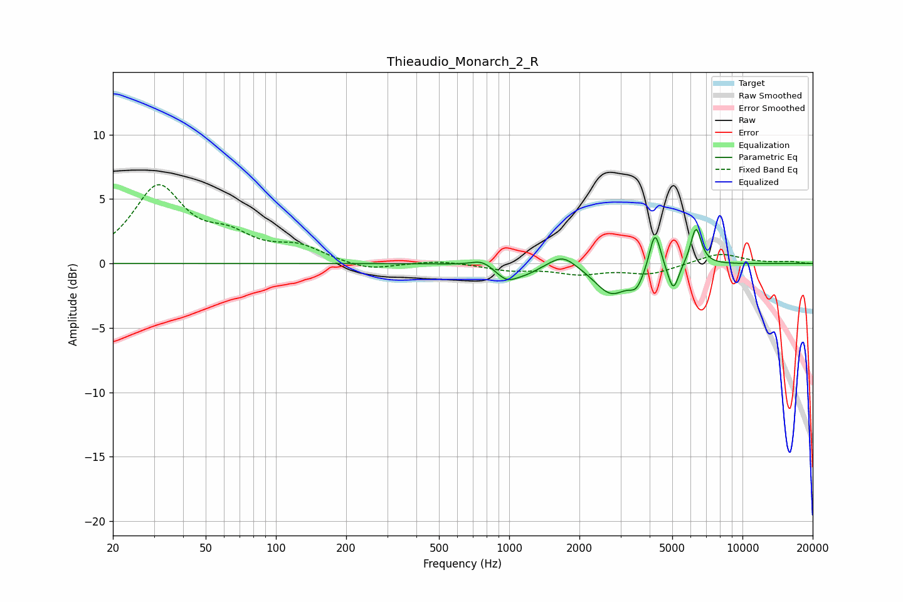

# Thieaudio_Monarch_2_R
See [usage instructions](https://github.com/jaakkopasanen/AutoEq#usage) for more options and info.

### Parametric EQs
Apply preamp of -2.7 dB when using parametric equalizer.

|   # | Type    |   Fc (Hz) |    Q |   Gain (dB) |
|-----|---------|-----------|------|-------------|
|   1 | Peaking |       767 | 3.19 |         0.5 |
|   2 | Peaking |       976 | 2.9  |        -1.1 |
|   3 | Peaking |      1191 | 2.34 |        -0.5 |
|   4 | Peaking |      1697 | 2.47 |         1   |
|   5 | Peaking |      2738 | 1.96 |        -2.3 |
|   6 | Peaking |      3512 | 4.52 |        -1.2 |
|   7 | Peaking |      4194 | 6    |         0.8 |
|   8 | Peaking |      4225 | 6    |         2.3 |
|   9 | Peaking |      5053 | 6    |        -2.2 |
|  10 | Peaking |      6317 | 6    |         2.9 |

### Fixed Band EQs
When using fixed band (also called graphic) equalizer, apply preamp of **-6.2 dB** (if available) and set gains manually with these parameters.

|   # | Type    |   Fc (Hz) |    Q |   Gain (dB) |
|-----|---------|-----------|------|-------------|
|   1 | Peaking |        31 | 1.41 |         5.8 |
|   2 | Peaking |        62 | 1.41 |         1.7 |
|   3 | Peaking |       125 | 1.41 |         1.2 |
|   4 | Peaking |       250 | 1.41 |        -0.6 |
|   5 | Peaking |       500 | 1.41 |         0.2 |
|   6 | Peaking |      1000 | 1.41 |        -0.5 |
|   7 | Peaking |      2000 | 1.41 |        -0.7 |
|   8 | Peaking |      4000 | 1.41 |        -0.8 |
|   9 | Peaking |      8000 | 1.41 |         0.8 |
|  10 | Peaking |     16000 | 1.41 |         0.1 |

### Graphs

