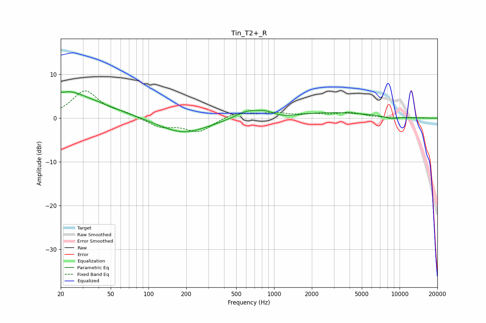

# Tin_T2+_R
See [usage instructions](https://github.com/jaakkopasanen/AutoEq#usage) for more options and info.

### Parametric EQs
Apply preamp of -6.2 dB when using parametric equalizer.

|   # | Type    |   Fc (Hz) |    Q |   Gain (dB) |
|-----|---------|-----------|------|-------------|
|   1 | Peaking |        20 | 5.6  |         3.4 |
|   2 | Peaking |        20 | 5.98 |        -3.1 |
|   3 | Peaking |        23 | 1.46 |         1.4 |
|   4 | Peaking |        25 | 0.5  |         4.6 |
|   5 | Peaking |       189 | 0.73 |        -3.5 |
|   6 | Peaking |       624 | 1.45 |         1.9 |
|   7 | Peaking |       869 | 2.49 |         1   |
|   8 | Peaking |      1136 | 0.88 |        -0.8 |
|   9 | Peaking |      2584 | 0.39 |         1.4 |
|  10 | Peaking |      8604 | 2.68 |        -0.6 |

### Fixed Band EQs
When using fixed band (also called graphic) equalizer, apply preamp of **-6.3 dB** (if available) and set gains manually with these parameters.

|   # | Type    |   Fc (Hz) |    Q |   Gain (dB) |
|-----|---------|-----------|------|-------------|
|   1 | Peaking |        31 | 1.41 |         6.2 |
|   2 | Peaking |        62 | 1.41 |         0.9 |
|   3 | Peaking |       125 | 1.41 |        -2   |
|   4 | Peaking |       250 | 1.41 |        -3.1 |
|   5 | Peaking |       500 | 1.41 |         1.3 |
|   6 | Peaking |      1000 | 1.41 |         1.1 |
|   7 | Peaking |      2000 | 1.41 |         0.7 |
|   8 | Peaking |      4000 | 1.41 |         1.2 |
|   9 | Peaking |      8000 | 1.41 |         0   |
|  10 | Peaking |     16000 | 1.41 |         0   |

### Graphs

