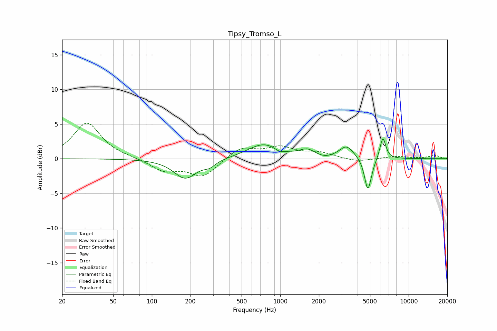

# Tipsy_Tromso_L
See [usage instructions](https://github.com/jaakkopasanen/AutoEq#usage) for more options and info.

### Parametric EQs
Apply preamp of -2.9 dB when using parametric equalizer.

|   # | Type    |   Fc (Hz) |    Q |   Gain (dB) |
|-----|---------|-----------|------|-------------|
|   1 | Peaking |       182 | 1.6  |        -2.8 |
|   2 | Peaking |       282 | 3.07 |        -0.8 |
|   3 | Peaking |       740 | 1.15 |         2.1 |
|   4 | Peaking |       990 | 3.97 |        -0.5 |
|   5 | Peaking |      1621 | 2.37 |         1   |
|   6 | Peaking |      2215 | 2.65 |        -0.3 |
|   7 | Peaking |      3282 | 2.56 |         1.8 |
|   8 | Peaking |      4795 | 5.55 |        -4.1 |
|   9 | Peaking |      4997 | 4.36 |        -0.9 |
|  10 | Peaking |      6298 | 5.99 |         3.2 |

### Fixed Band EQs
When using fixed band (also called graphic) equalizer, apply preamp of **-5.2 dB** (if available) and set gains manually with these parameters.

|   # | Type    |   Fc (Hz) |    Q |   Gain (dB) |
|-----|---------|-----------|------|-------------|
|   1 | Peaking |        31 | 1.41 |         5.2 |
|   2 | Peaking |        62 | 1.41 |         0.1 |
|   3 | Peaking |       125 | 1.41 |        -1.7 |
|   4 | Peaking |       250 | 1.41 |        -2.6 |
|   5 | Peaking |       500 | 1.41 |         1.7 |
|   6 | Peaking |      1000 | 1.41 |         1.5 |
|   7 | Peaking |      2000 | 1.41 |         0.8 |
|   8 | Peaking |      4000 | 1.41 |        -0.5 |
|   9 | Peaking |      8000 | 1.41 |         0.3 |
|  10 | Peaking |     16000 | 1.41 |         0.5 |

### Graphs

