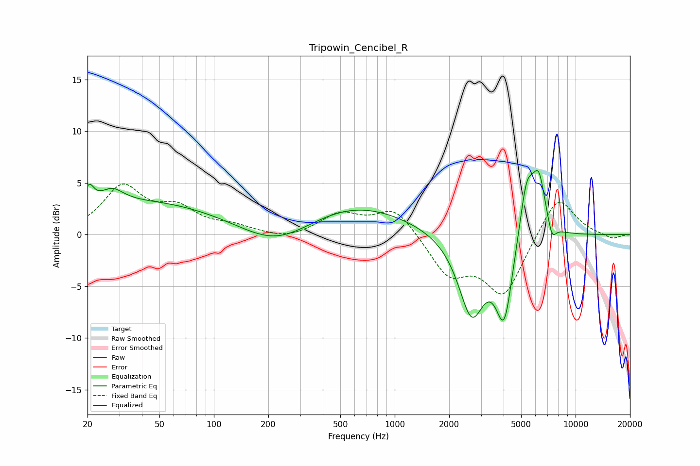

# Tripowin_Cencibel_R
See [usage instructions](https://github.com/jaakkopasanen/AutoEq#usage) for more options and info.

### Parametric EQs
Apply preamp of -6.3 dB when using parametric equalizer.

|   # | Type    |   Fc (Hz) |    Q |   Gain (dB) |
|-----|---------|-----------|------|-------------|
|   1 | Peaking |        20 | 5.27 |         1.9 |
|   2 | Peaking |        27 | 2.19 |         1.5 |
|   3 | Peaking |        43 | 0.33 |         3.1 |
|   4 | Peaking |       222 | 0.74 |        -2.3 |
|   5 | Peaking |       598 | 0.48 |         2.9 |
|   6 | Peaking |      2661 | 1.92 |        -7.8 |
|   7 | Peaking |      4032 | 2.98 |        -7.7 |
|   8 | Peaking |      5368 | 3.34 |         5.7 |
|   9 | Peaking |      6267 | 3.76 |         5.1 |
|  10 | Peaking |      7407 | 5.94 |        -1.6 |

### Fixed Band EQs
When using fixed band (also called graphic) equalizer, apply preamp of **-5.0 dB** (if available) and set gains manually with these parameters.

|   # | Type    |   Fc (Hz) |    Q |   Gain (dB) |
|-----|---------|-----------|------|-------------|
|   1 | Peaking |        31 | 1.41 |         4.5 |
|   2 | Peaking |        62 | 1.41 |         2.2 |
|   3 | Peaking |       125 | 1.41 |         0.7 |
|   4 | Peaking |       250 | 1.41 |        -0.6 |
|   5 | Peaking |       500 | 1.41 |         1.9 |
|   6 | Peaking |      1000 | 1.41 |         2.6 |
|   7 | Peaking |      2000 | 1.41 |        -3.7 |
|   8 | Peaking |      4000 | 1.41 |        -5.7 |
|   9 | Peaking |      8000 | 1.41 |         4   |
|  10 | Peaking |     16000 | 1.41 |        -0.5 |

### Graphs

