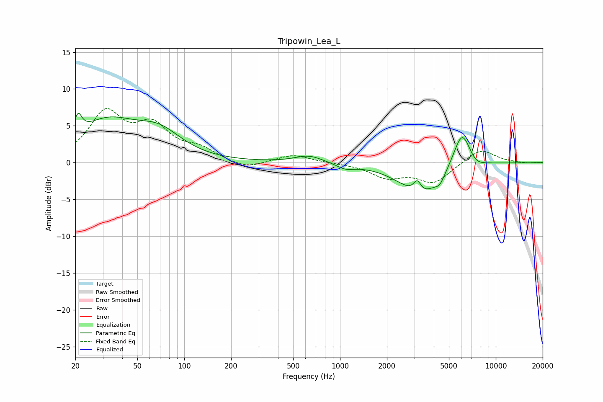

# Tripowin_Lea_L
See [usage instructions](https://github.com/jaakkopasanen/AutoEq#usage) for more options and info.

### Parametric EQs
Apply preamp of -6.8 dB when using parametric equalizer.

|   # | Type    |   Fc (Hz) |    Q |   Gain (dB) |
|-----|---------|-----------|------|-------------|
|   1 | Peaking |        21 | 5.99 |         2.6 |
|   2 | Peaking |        32 | 0.71 |         5.2 |
|   3 | Peaking |        69 | 0.98 |         3.1 |
|   4 | Peaking |       631 | 1.57 |         1   |
|   5 | Peaking |      1085 | 2.49 |        -0.7 |
|   6 | Peaking |      3128 | 5.95 |         1.6 |
|   7 | Peaking |      3330 | 1.03 |        -4.5 |
|   8 | Peaking |      4372 | 4.97 |        -1   |
|   9 | Peaking |      6070 | 2.42 |         5.3 |
|  10 | Peaking |      7408 | 2.64 |        -0.9 |

### Fixed Band EQs
When using fixed band (also called graphic) equalizer, apply preamp of **-7.4 dB** (if available) and set gains manually with these parameters.

|   # | Type    |   Fc (Hz) |    Q |   Gain (dB) |
|-----|---------|-----------|------|-------------|
|   1 | Peaking |        31 | 1.41 |         6.5 |
|   2 | Peaking |        62 | 1.41 |         4.4 |
|   3 | Peaking |       125 | 1.41 |         1.6 |
|   4 | Peaking |       250 | 1.41 |        -1   |
|   5 | Peaking |       500 | 1.41 |         1.1 |
|   6 | Peaking |      1000 | 1.41 |        -0   |
|   7 | Peaking |      2000 | 1.41 |        -1.9 |
|   8 | Peaking |      4000 | 1.41 |        -2.6 |
|   9 | Peaking |      8000 | 1.41 |         2   |
|  10 | Peaking |     16000 | 1.41 |        -0.1 |

### Graphs

