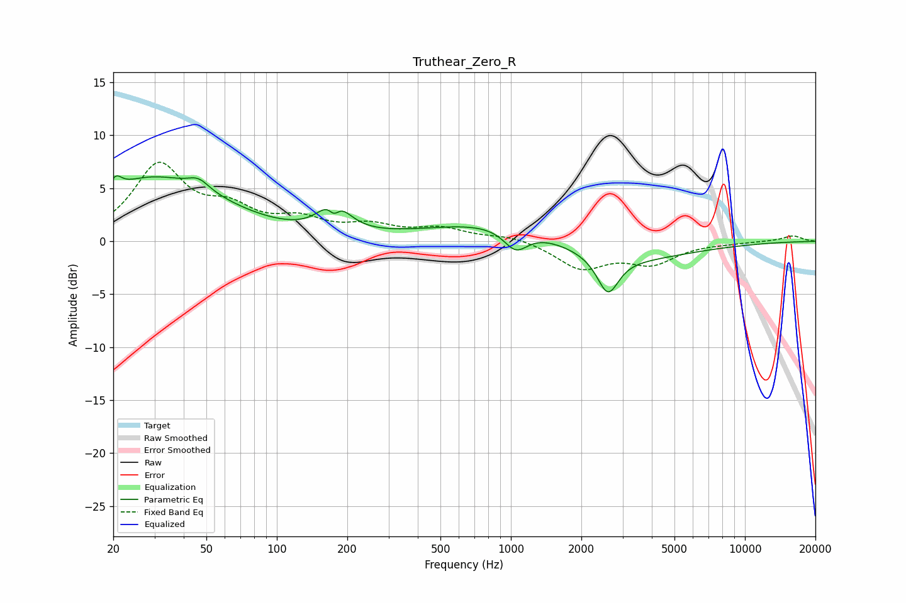

# Truthear_Zero_R
See [usage instructions](https://github.com/jaakkopasanen/AutoEq#usage) for more options and info.

### Parametric EQs
Apply preamp of -6.3 dB when using parametric equalizer.

|   # | Type    |   Fc (Hz) |    Q |   Gain (dB) |
|-----|---------|-----------|------|-------------|
|   1 | Peaking |        20 | 5.74 |         1.3 |
|   2 | Peaking |        27 | 0.65 |         4.8 |
|   3 | Peaking |        46 | 3.17 |         1   |
|   4 | Peaking |        50 | 0.61 |         1.7 |
|   5 | Peaking |       175 | 2.61 |         3.5 |
|   6 | Peaking |       176 | 5.65 |        -1.8 |
|   7 | Peaking |      1050 | 2.74 |        -2   |
|   8 | Peaking |      1352 | 0.38 |         3.4 |
|   9 | Peaking |      2491 | 0.48 |        -3.8 |
|  10 | Peaking |      2598 | 3.16 |        -3.5 |

### Fixed Band EQs
When using fixed band (also called graphic) equalizer, apply preamp of **-7.6 dB** (if available) and set gains manually with these parameters.

|   # | Type    |   Fc (Hz) |    Q |   Gain (dB) |
|-----|---------|-----------|------|-------------|
|   1 | Peaking |        31 | 1.41 |         6.9 |
|   2 | Peaking |        62 | 1.41 |         2.4 |
|   3 | Peaking |       125 | 1.41 |         1.7 |
|   4 | Peaking |       250 | 1.41 |         1.2 |
|   5 | Peaking |       500 | 1.41 |         1.1 |
|   6 | Peaking |      1000 | 1.41 |         0.5 |
|   7 | Peaking |      2000 | 1.41 |        -2.5 |
|   8 | Peaking |      4000 | 1.41 |        -1.9 |
|   9 | Peaking |      8000 | 1.41 |        -0.1 |
|  10 | Peaking |     16000 | 1.41 |         0.5 |

### Graphs

