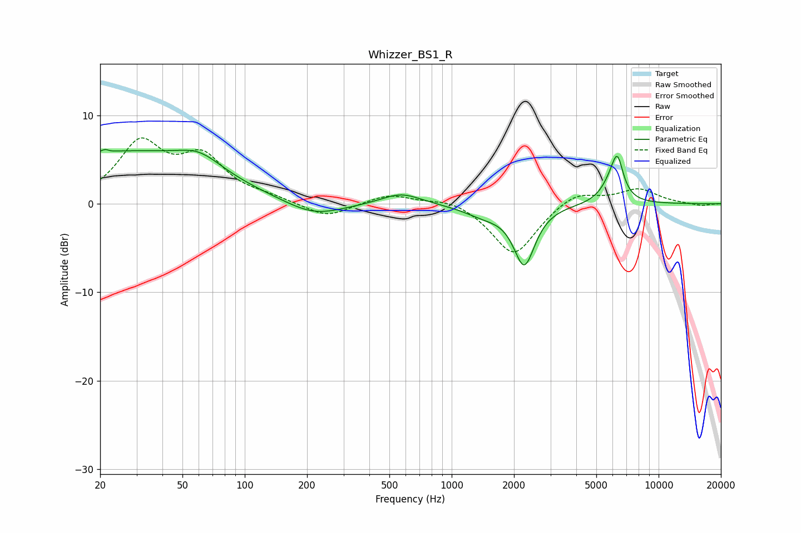

# Whizzer_BS1_R
See [usage instructions](https://github.com/jaakkopasanen/AutoEq#usage) for more options and info.

### Parametric EQs
Apply preamp of -6.2 dB when using parametric equalizer.

|   # | Type    |   Fc (Hz) |    Q |   Gain (dB) |
|-----|---------|-----------|------|-------------|
|   1 | Peaking |        22 | 5.87 |         2.9 |
|   2 | Peaking |        22 | 5.97 |        -2.6 |
|   3 | Peaking |        26 | 0.33 |         5.7 |
|   4 | Peaking |        60 | 1.31 |         1.9 |
|   5 | Peaking |       216 | 1.01 |        -1.7 |
|   6 | Peaking |       571 | 1.48 |         1.3 |
|   7 | Peaking |      1432 | 1.42 |        -1.1 |
|   8 | Peaking |      2243 | 2.76 |        -6.6 |
|   9 | Peaking |      5923 | 2.79 |         2   |
|  10 | Peaking |      6324 | 4.99 |         3.8 |

### Fixed Band EQs
When using fixed band (also called graphic) equalizer, apply preamp of **-7.5 dB** (if available) and set gains manually with these parameters.

|   # | Type    |   Fc (Hz) |    Q |   Gain (dB) |
|-----|---------|-----------|------|-------------|
|   1 | Peaking |        31 | 1.41 |         6.5 |
|   2 | Peaking |        62 | 1.41 |         4.8 |
|   3 | Peaking |       125 | 1.41 |         0.6 |
|   4 | Peaking |       250 | 1.41 |        -1.6 |
|   5 | Peaking |       500 | 1.41 |         1.1 |
|   6 | Peaking |      1000 | 1.41 |         0.7 |
|   7 | Peaking |      2000 | 1.41 |        -5.9 |
|   8 | Peaking |      4000 | 1.41 |         1.5 |
|   9 | Peaking |      8000 | 1.41 |         1.6 |
|  10 | Peaking |     16000 | 1.41 |        -0.3 |

### Graphs

