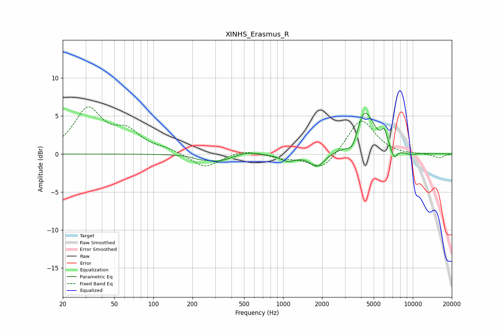

# XINHS_Erasmus_R
See [usage instructions](https://github.com/jaakkopasanen/AutoEq#usage) for more options and info.

### Parametric EQs
Apply preamp of -5.5 dB when using parametric equalizer.

|   # | Type    |   Fc (Hz) |    Q |   Gain (dB) |
|-----|---------|-----------|------|-------------|
|   1 | Peaking |       227 | 2.84 |        -0.3 |
|   2 | Peaking |       317 | 1.42 |        -0.9 |
|   3 | Peaking |       530 | 1.68 |         0.4 |
|   4 | Peaking |      1086 | 2.46 |        -0.9 |
|   5 | Peaking |      1834 | 2.46 |        -1.8 |
|   6 | Peaking |      3450 | 3.17 |        -2.1 |
|   7 | Peaking |      4237 | 1.91 |         6.1 |
|   8 | Peaking |      6036 | 5.99 |         1.8 |
|   9 | Peaking |      7194 | 5.75 |        -1.4 |
|  10 | Peaking |      9625 | 2.7  |        -0.3 |

### Fixed Band EQs
When using fixed band (also called graphic) equalizer, apply preamp of **-6.3 dB** (if available) and set gains manually with these parameters.

|   # | Type    |   Fc (Hz) |    Q |   Gain (dB) |
|-----|---------|-----------|------|-------------|
|   1 | Peaking |        31 | 1.41 |         5.7 |
|   2 | Peaking |        62 | 1.41 |         2.6 |
|   3 | Peaking |       125 | 1.41 |         0.5 |
|   4 | Peaking |       250 | 1.41 |        -1.9 |
|   5 | Peaking |       500 | 1.41 |         0.6 |
|   6 | Peaking |      1000 | 1.41 |        -0.5 |
|   7 | Peaking |      2000 | 1.41 |        -2.2 |
|   8 | Peaking |      4000 | 1.41 |         4.7 |
|   9 | Peaking |      8000 | 1.41 |        -0.1 |
|  10 | Peaking |     16000 | 1.41 |        -0.5 |

### Graphs

