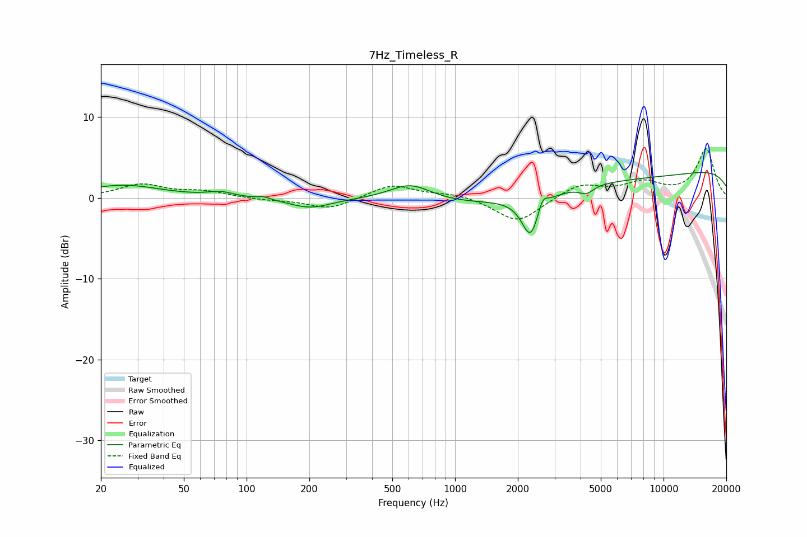

# 7Hz_Timeless_R
See [usage instructions](https://github.com/jaakkopasanen/AutoEq#usage) for more options and info.

### Parametric EQs
Apply preamp of -3.2 dB when using parametric equalizer.

|   # | Type    |   Fc (Hz) |    Q |   Gain (dB) |
|-----|---------|-----------|------|-------------|
|   1 | Peaking |        26 | 0.79 |         1.6 |
|   2 | Peaking |        75 | 2.39 |         0.6 |
|   3 | Peaking |       121 | 4.96 |         0.3 |
|   4 | Peaking |       201 | 1.4  |        -1.2 |
|   5 | Peaking |       610 | 1.39 |         2.1 |
|   6 | Peaking |      2307 | 3.34 |        -5.2 |
|   7 | Peaking |      2626 | 5.96 |         1.8 |
|   8 | Peaking |      4264 | 4.29 |        -0.9 |
|   9 | Peaking |      4638 | 0.18 |        -2.7 |
|  10 | Peaking |      9634 | 0.18 |         5.1 |

### Fixed Band EQs
When using fixed band (also called graphic) equalizer, apply preamp of **-6.2 dB** (if available) and set gains manually with these parameters.

|   # | Type    |   Fc (Hz) |    Q |   Gain (dB) |
|-----|---------|-----------|------|-------------|
|   1 | Peaking |        31 | 1.41 |         1.6 |
|   2 | Peaking |        62 | 1.41 |         0.7 |
|   3 | Peaking |       125 | 1.41 |        -0.2 |
|   4 | Peaking |       250 | 1.41 |        -1.4 |
|   5 | Peaking |       500 | 1.41 |         1.7 |
|   6 | Peaking |      1000 | 1.41 |         0.5 |
|   7 | Peaking |      2000 | 1.41 |        -3.1 |
|   8 | Peaking |      4000 | 1.41 |         1.7 |
|   9 | Peaking |      8000 | 1.41 |         1.7 |
|  10 | Peaking |     16000 | 1.41 |         6   |

### Graphs

