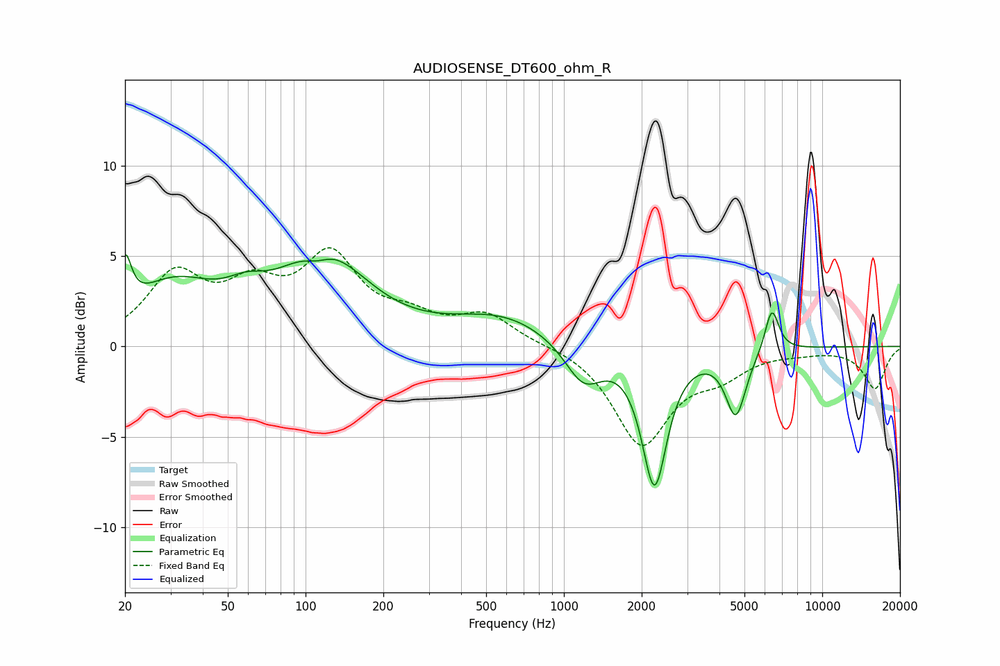

# AUDIOSENSE_DT600_ohm_R
See [usage instructions](https://github.com/jaakkopasanen/AutoEq#usage) for more options and info.

### Parametric EQs
Apply preamp of -5.2 dB when using parametric equalizer.

|   # | Type    |   Fc (Hz) |    Q |   Gain (dB) |
|-----|---------|-----------|------|-------------|
|   1 | Peaking |        20 | 5.98 |         2.8 |
|   2 | Peaking |        31 | 0.86 |         3.1 |
|   3 | Peaking |        59 | 1.85 |         0.9 |
|   4 | Peaking |       111 | 2.68 |        -0.7 |
|   5 | Peaking |       117 | 0.84 |         4.9 |
|   6 | Peaking |       578 | 0.71 |         1.6 |
|   7 | Peaking |      1191 | 1.93 |        -2.3 |
|   8 | Peaking |      2242 | 2.94 |        -7.5 |
|   9 | Peaking |      4629 | 3.58 |        -3.6 |
|  10 | Peaking |      6382 | 5.1  |         2.5 |

### Fixed Band EQs
When using fixed band (also called graphic) equalizer, apply preamp of **-5.6 dB** (if available) and set gains manually with these parameters.

|   # | Type    |   Fc (Hz) |    Q |   Gain (dB) |
|-----|---------|-----------|------|-------------|
|   1 | Peaking |        31 | 1.41 |         3.7 |
|   2 | Peaking |        62 | 1.41 |         2.6 |
|   3 | Peaking |       125 | 1.41 |         4.6 |
|   4 | Peaking |       250 | 1.41 |         1.2 |
|   5 | Peaking |       500 | 1.41 |         1.6 |
|   6 | Peaking |      1000 | 1.41 |         0.1 |
|   7 | Peaking |      2000 | 1.41 |        -5.3 |
|   8 | Peaking |      4000 | 1.41 |        -1.3 |
|   9 | Peaking |      8000 | 1.41 |        -0.2 |
|  10 | Peaking |     16000 | 1.41 |        -2.3 |

### Graphs

