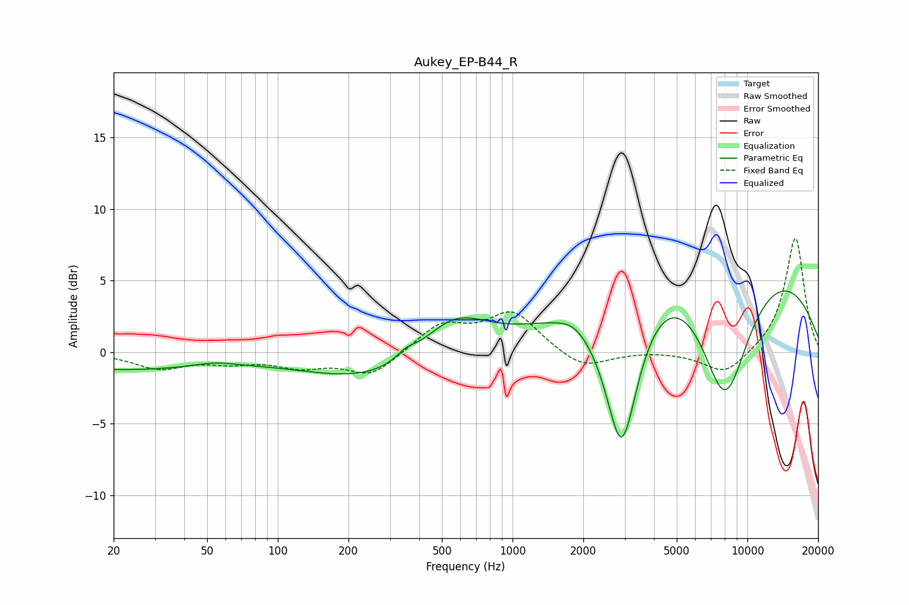

# Aukey_EP-B44_R
See [usage instructions](https://github.com/jaakkopasanen/AutoEq#usage) for more options and info.

### Parametric EQs
Apply preamp of -4.4 dB when using parametric equalizer.

|   # | Type    |   Fc (Hz) |    Q |   Gain (dB) |
|-----|---------|-----------|------|-------------|
|   1 | Peaking |        21 | 0.36 |        -1.2 |
|   2 | Peaking |        54 | 1.68 |         0.3 |
|   3 | Peaking |       351 | 3.38 |         0.5 |
|   4 | Peaking |       559 | 0.93 |         3.6 |
|   5 | Peaking |       645 | 0.26 |        -4.2 |
|   6 | Peaking |      1810 | 2.55 |         0.4 |
|   7 | Peaking |      2718 | 0.21 |         5.2 |
|   8 | Peaking |      2914 | 1.81 |       -12   |
|   9 | Peaking |      8008 | 1.07 |       -11.7 |
|  10 | Peaking |      8648 | 0.24 |         6.3 |

### Fixed Band EQs
When using fixed band (also called graphic) equalizer, apply preamp of **-8.0 dB** (if available) and set gains manually with these parameters.

|   # | Type    |   Fc (Hz) |    Q |   Gain (dB) |
|-----|---------|-----------|------|-------------|
|   1 | Peaking |        31 | 1.41 |        -1.1 |
|   2 | Peaking |        62 | 1.41 |        -0.6 |
|   3 | Peaking |       125 | 1.41 |        -0.9 |
|   4 | Peaking |       250 | 1.41 |        -1.6 |
|   5 | Peaking |       500 | 1.41 |         1.9 |
|   6 | Peaking |      1000 | 1.41 |         2.7 |
|   7 | Peaking |      2000 | 1.41 |        -1.3 |
|   8 | Peaking |      4000 | 1.41 |         0.1 |
|   9 | Peaking |      8000 | 1.41 |        -1.6 |
|  10 | Peaking |     16000 | 1.41 |         8.1 |

### Graphs

